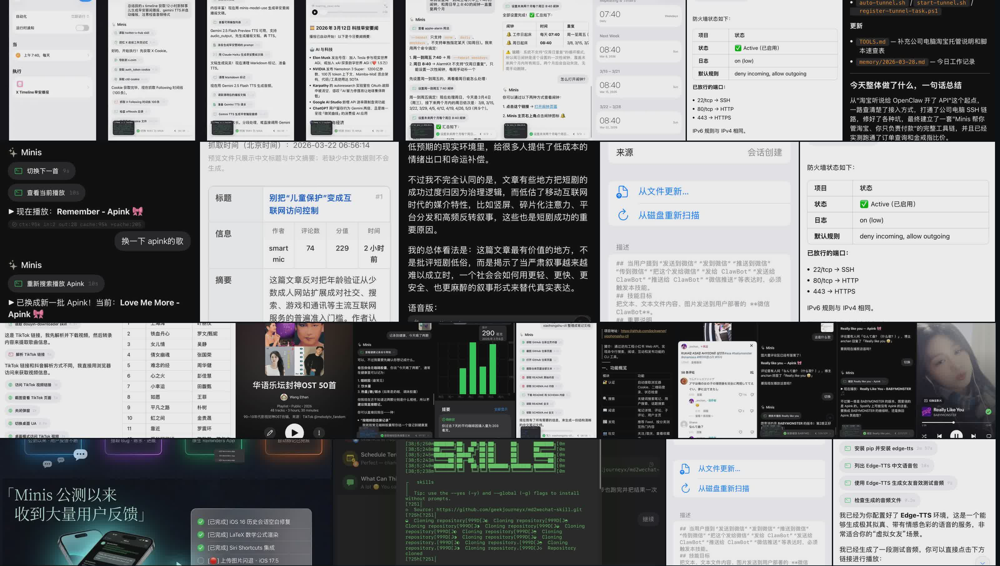

# 😎 Awesome Minis 

> A curated collection of real-world **[Minis](https://openminis.app)** use cases, workflows, and creative scenarios — contributed by the community.

**Minis** is an AI-powered assistant running on iOS with a full Linux shell (Alpine Linux), native Apple framework integrations (HealthKit, Calendar, Reminders, HomeKit, etc.), and a rich skill ecosystem. This repository collects the best ways people are actually using it.

---

## 📋 Table of Contents

- [Health & Wellness](#-health--wellness)
- [Productivity & Automation](#-productivity--automation)
- [Data & Research](#-data--research)
- [Creative & Content](#-creative--content)
- [Developer Tools](#-developer-tools)
- [Contributing](#-contributing)

---

## 🏥 Health & Wellness

| Name | Description | By | Skills Used |
|------|-------------|----|-------------|
| [Apple Watch Heart Health Monitor](cases/health/apple-watch-heart-health.md) | Analyze heart rate, HRV, blood oxygen, and ECG data from HealthKit to detect early warning signs and generate a risk report | OpenMinis | `cardiac-health-monitor` |
| [Photo a Coffee → Auto-Log Caffeine](cases/health/photo-log-caffeine.md) | Take a photo of your coffee, Minis identifies it and automatically logs the caffeine intake to Apple Health | @wsvn53 | Built-in |
| [Photo Every Meal → Auto-Log Nutrition](cases/health/photo-log-meals.md) | Snap a photo of each meal — Minis identifies dishes, estimates calories/protein/carbs, and logs it all to Apple Health | @infinite_Game_ | Built-in |

## ⚡ Productivity & Automation

| Name | Description | By | Skills Used |
|------|-------------|----|-------------|
| [Smart Daily Briefing](cases/productivity/smart-daily-briefing.md) | Every morning: pull calendar events, weather, news headlines, and Reminders into a single spoken briefing | OpenMinis | Built-in |
| [X Timeline Voice Alarm](cases/productivity/x-timeline-voice-alarm.md) | Replace your morning alarm — Shortcuts auto-fetches your X Timeline, summarizes it, generates TTS audio, and plays it to wake you up | @wsvn53 | `twitter-x-hub`, `doubao-tts` |
| [Auto-Create Calendar from Shared Content](cases/productivity/auto-create-calendar-from-share.md) | Share any content with a time and place to Minis via the iOS Share Sheet — it instantly creates the calendar event | @wsvn53 | Built-in |
| [Daily Briefing Auto-Push to WeChat](cases/productivity/daily-briefing-wechat-push.md) | Schedule Minis on iPad to fetch weather + news daily and auto-push to WeChat via openilink-hub | meng nimen | Built-in + openilink-hub |
| [Push Minis Results to WeChat](cases/productivity/wechat-push-via-openilink.md) | Use openilink-hub middleware to push any Minis output (reports, alerts, summaries) to WeChat | meng nimen | Built-in + openilink-hub |
| [Group Messages → Auto-Extract to Reminders](cases/productivity/group-messages-to-reminders.md) | Pull Telegram group messages, auto-extract bugs and tasks, deduplicate, and write to Apple Reminders | @wsvn53 | `tg-hub`, Built-in |
| [Web Page → Apple Notes](cases/productivity/webpage-to-apple-notes.md) | Send any URL to Minis — it fetches, summarizes, and saves structured notes directly to Apple Notes | @wsvn53 | Built-in |
| [Batch Set Complex Alarms](cases/productivity/batch-set-alarms.md) | Describe your entire alarm schedule in one message — Minis creates all of them at once | appinn | Built-in |
| [Convert Notes & Ideas into Dida Tasks](cases/productivity/todo-from-notes-dida.md) | Dump raw notes or brain dumps to Minis — it extracts and polishes them into tasks and writes them to Dida (TickTick) | SI7gen1 | Custom (Dida API) |
| [Schedule Minis Tasks via iOS Shortcuts](cases/productivity/shortcuts-scheduled-task.md) | Use iOS Shortcuts automations to trigger Minis tasks on a schedule — no manual app launch needed | Community | iOS Shortcuts |
| [Remote Control Home Phone to Run Tasks](cases/productivity/remote-control-home-phone.md) | Remotely trigger Minis tasks on your home phone/iPad from anywhere via SSH or network | 朦胧 | Built-in (SSH) |
| [Taobao Store Management](cases/productivity/taobao-store-management.md) | Built a complete Taobao toolkit from scratch via SSH — order tracking, price comparison, cart management, buyer chat — zero code knowledge required | Da weiwei | Built-in (SSH + shell) |

## 🔬 Data & Research

| Name | Description | By | Skills Used |
|------|-------------|----|-------------|
| [Automated Paywall Bypass Article Reader](cases/research/paywall-bypass-reader.md) | Automatically rewrite paywalled article URLs to public archive links and read full content inside the chat | oneasai | Built-in (browser) |
| [Fetch HK News & Generate Chinese HTML Digest](cases/research/hk-news-html-digest.md) | Fetch Hong Kong news articles, translate and summarize in Chinese, output as a formatted HTML digest | meng nimen | Built-in (browser) |
| [City Commercial Market Research Report](cases/research/city-commercial-market-research.md) | One sentence → Minis searches JLL/Winshang/DTZ, writes analysis scripts, and generates a full market report with charts | @wsvn53 | Built-in |

## 🎨 Creative & Content

| Name | Description | By | Skills Used |
|------|-------------|----|-------------|
| [One-Click PPT Generator](cases/creative/one-click-ppt-generator.md) | Turn a script or outline into a Jobs-style minimal HTML presentation in seconds | OpenMinis | `ppt-generator` |
| [End-to-End Automated Video Production](cases/creative/automated-video-production.md) | Research → script → TTS voiceover → image search → ffmpeg edit → upload to Bilibili, all in one session (200+ tool calls) | @wsvn53 | `bilibili-hub`, `doubao-tts`, ffmpeg |
| [TikTok Song → YouTube Music Playlist](cases/creative/tiktok-to-ytmusic-playlist.md) | Screenshot TikTok comments with song names, Minis OCRs them and batch-adds all songs to your YouTube Music playlist | @wsvn53 | `ytmusic-hub` |
| [Spotify Voice Control](cases/creative/spotify-voice-control.md) | Search songs, skip tracks, and control Spotify playback with a single sentence — no app needed | @wsvn53 | `spotify-hub` |
| [Read Article Then Auto-Generate Audio](cases/creative/article-read-then-tts.md) | After summarizing an article, automatically generate a matching audio version with doubao-tts and auto-play it | oneasai | `doubao-tts` |
| [Local Lightweight TTS on Old iPhone](cases/creative/edge-tts-local-voice.md) | Install edge-tts via Minis shell for free, offline TTS — works even on a 64GB iPhone 8 Plus | 小渔 黄 | edge-tts (shell) |

## 🛠 Developer Tools

| Name | Description | By | Skills Used |
|------|-------------|----|-------------|
| [Managing Oracle Free-Tier Servers](cases/developer/turtle-oracle-server-management.md) | Manage multiple Oracle free-tier servers with natural language — check disk, memory, services, run commands | 采菇凉滴小蘑菇 | Built-in (SSH) |
| [Auto-Copy Skills Between Devices/Agents](cases/developer/skill-copy-between-devices.md) | Let Minis detect and copy all skill configs from another AI agent platform and recreate them | 如幻 | Built-in |

---

## 🧩 Skills

The use cases above leverage **Minis Skills** — reusable instruction sets that extend what Minis can do. Browse the official skill registry:

👉 **[OpenMinis/MinisSkills](https://github.com/OpenMinis/MinisSkills)**

Want to create your own skill? Use the built-in `skill-creator` skill for guided instructions.

---

## 🤝 Contributing

We welcome contributions from the community! Please read **[CONTRIBUTING.md](CONTRIBUTING.md)** before submitting.

**Quick summary:**
- Each use case lives in its own Markdown file under the appropriate `cases/` subfolder
- Use the [case template](CASE_TEMPLATE.md) to structure your submission
- Only submit use cases you have personally tested and verified
- Open a Pull Request — one use case per PR is preferred

---

## 📜 License

[CC0 1.0 Universal](LICENSE) — Public Domain. Use freely, no attribution required.

---

  Made with ❤️ by the <a href="https://github.com/OpenMinis">OpenMinis</a> community

