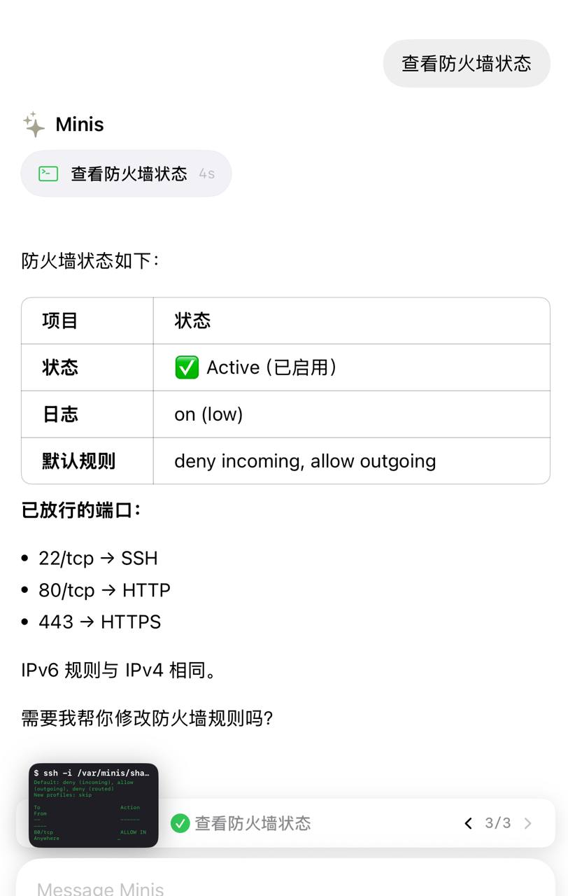

# Managing Oracle Free-Tier Servers with Minis

> 💬 *From the Open Minis community — shared by **picking mushrooms and cooling drops of small mushrooms** on 2026-03-27*

---

## 🎯 Pain Point

Managing multiple servers requires memorizing commands and switching SSH clients constantly.

---

## 💡 What It Does

Uses Minis' built-in SSH capability to manage multiple Oracle free-tier servers. Run maintenance tasks in natural language — no need to memorize commands.

---

## 🛠 Skills Used

| Skill | Purpose |
|-------|---------|
| `built-in (ssh)` | — |

---

## 💬 Example Prompt


```
SSH into my Oracle server at [IP], check disk usage, memory, and running services, and give me a status summary.
```

---


## 📸 Screenshots



*📷 Shared by ** Picking Mushrooms Liangdi Little Mushrooms ** · 2026-03-27* — Minis SSH View server firewall status


*📷 Shared by **picking mushrooms, cold dripping small mushrooms** · 2026-03-27* — SSH connection to Oracle server

## ⚙️ Requirements

- [ ] SSH key configured or password known
- [ ] The server network is reachable

---

## 🏷 Tags

`ssh` `server` `devops` `oracle`

---

## 👤 Contributor

From the Open Minis Telegram community

Original sharer: **Mushroom picking and cold dripping of small mushrooms**

---

## 📅 Last Verified

2026-03-27
