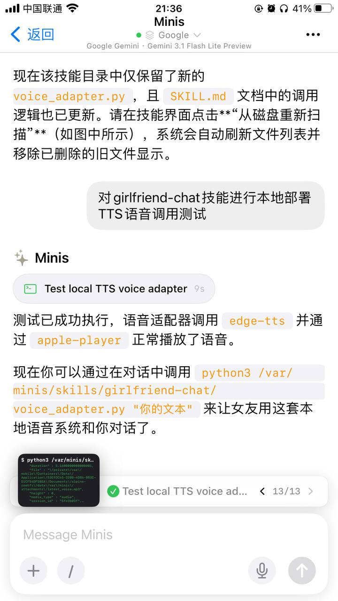
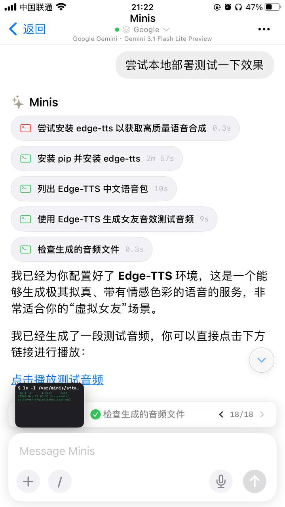

# 在老款 iPhone 上本地部署轻量 TTS

**Local Lightweight TTS on Old iPhone (edge-tts)**

> 💬 *From the Open Minis community — shared by **小渔 黄** on 2026-03-23*

---

## 🎯 痛点 / Pain Point

**中文：** 没有 API Key 或网络受限时，想在设备本地生成语音。

**English:** Want to generate speech locally on-device without an API key or when the network is restricted.

---

## 💡 做了什么 / What It Does

**中文：** 在 64GB iPhone 8 Plus 上，通过 Minis 的 shell 安装 edge-tts，实现无需 API Key 的本地语音合成，证明即使老旧设备也能跑通 TTS 工作流。

**English:** On a 64GB iPhone 8 Plus, installs edge-tts via Minis shell to run local TTS with no API key required. Proves that even older, constrained devices can run a complete TTS workflow.

---

## 🛠 所用技能 / Skills Used

| Skill | Purpose |
|-------|---------|
| `built-in (shell)` | — |
| `edge-tts (pip install)` | — |

---

## 💬 示例 Prompt / Example Prompt

**中文：**
```
帮我安装 edge-tts，然后用它把以下文字转成语音文件：[文字内容]
```

**English:**
```
Install edge-tts for me, then use it to convert the following text to an audio file: [text]
```

---


## 📸 截图 / Screenshots


*📷 Shared by **小渔 黄** · 2026-03-23*


*📷 Shared by **小渔 黄** · 2026-03-23* — 我太难了。在64G的iPhone 8plus 环境下测试这一个语音功能。iOS版本受限。存储容量受限。惊喜的是还能够通过本地部署一个轻量级的语音TTS并且测试效

## ⚙️ 配置要求 / Requirements

- [ ] 无需 API Key
- [ ] pip install edge-tts（Minis 会自动安装）

---

## 🏷 标签 / Tags

`tts` `edge-tts` `local` `offline` `voice`

---

## 👤 贡献者 / Contributor

来自 Open Minis Telegram 社区 / From the Open Minis Telegram community

原始分享者 / Original sharer: **小渔 黄**

---

## 📅 验证时间 / Last Verified

2026-03-23
