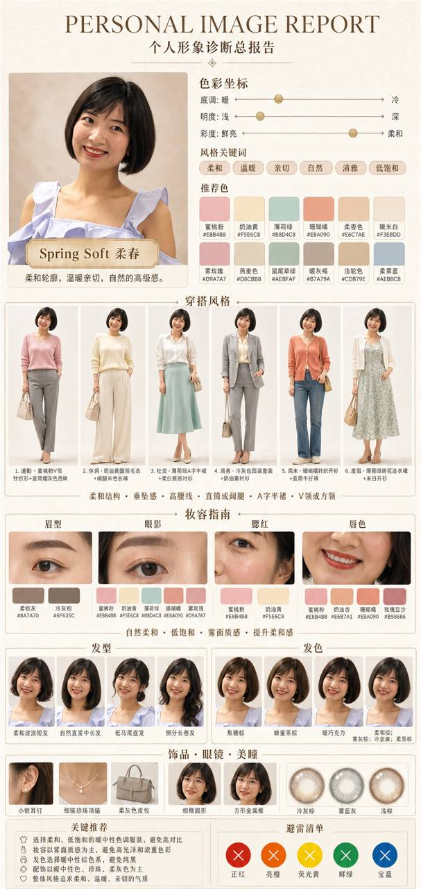
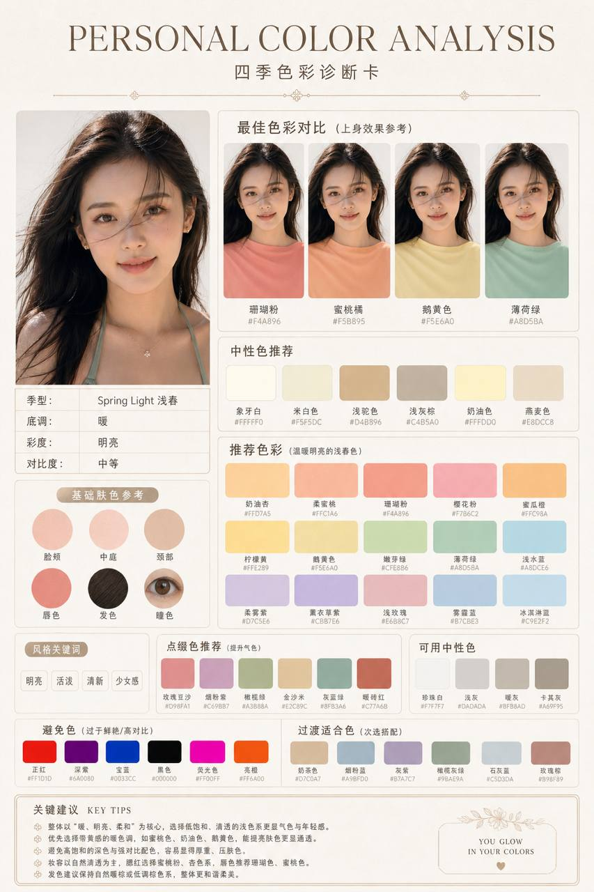
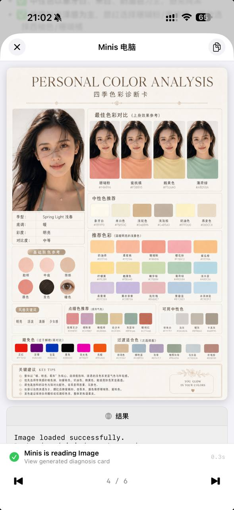
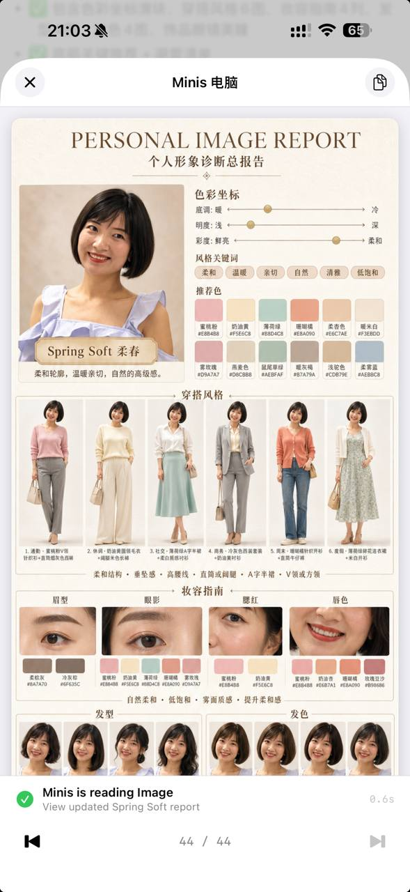

# AI 个人色彩分析——上传自拍，秒出专业诊断报告

**贡献者**: 采菇凉滴小蘑菇 | **分类**: creative | **日期**: 2026-05-02

---

上传一张自拍，Minis 自动分析你的个人色彩季型，生成一套专业诊断图文报告。

制作了一个完整的 Personal Color Analysis Skill：从 4 个维度分析人像（冷暖调/明度/彩度/对比度），自动判定 12 季型，并生成两张专业图片——色彩诊断卡和个人形象诊断总报告，穿搭、妆容、发型、发色、饰品建议一步到位。男女通用。

## 使用方式

1. 把自拍发给 Minis（正脸、自然光、淡妆或素颜）
2. 说「帮我做个人色彩分析」或「personal color」
3. Minis 自动完成分析并生成报告

## 效果展示

## Skill 能做什么

- **季型判定**：12 季（浅春 / 亮春 / 柔春 / 浅夏 / 柔夏 / 冷夏 / 柔秋 / 暖秋 / 深秋 / 亮冬 / 冷冬 / 深冬）
- **色彩诊断卡**：色彩坐标 + 推荐色系（最佳色 / 中性色 / 强调色 / 避雷色共 7 档）
- **个人形象诊断总报告**：
  - 6 套场景穿搭（通勤 / 休闲 / 社交 / 商务 / 周末 / 度假）
  - 妆容配色（眉型 / 眼影 / 腮红 / 唇色）
  - 发型 + 发色推荐
  - 饰品 / 眼镜 / 美瞳建议

---

# AI Personal Color Analysis — Upload a Selfie, Get a Professional Diagnosis Report

**Contributor**: 采菇凉滴小蘑菇 | **Category**: creative | **Date**: 2026-05-02

---

Upload a selfie, and Minis analyzes your seasonal color type and generates a full professional diagnosis report.

A complete Personal Color Analysis Skill: analyzes portraits across 4 dimensions (warm/cool tone, lightness, chroma, contrast), determines 1 of 12 seasonal types, and generates two professional images — a Color Diagnosis Card and a Personal Image Report covering outfits, makeup, hairstyle, hair color, and accessories. Works for all genders.

## How to Use

1. Send a selfie to Minis (front-facing, natural light, no heavy makeup)
2. Say "personal color analysis" or "帮我做个人色彩分析"
3. Minis analyzes and generates the full report automatically

## Screenshots

## What the Skill Generates

- **Season type**: 12 types (Spring/Summer/Autumn/Winter × Light/Bright/Soft subtypes)
- **Color Diagnosis Card**: color coordinates + 7-tier palette (best colors, neutrals, accents, colors to avoid, etc.)
- **Personal Image Report**:
  - 6 outfit scenes (commute / casual / social / business / weekend / vacation)
  - Makeup palette (brows / eyeshadow / blush / lips)
  - Hairstyle + hair color recommendations
  - Accessories / glasses / contact lens suggestions
