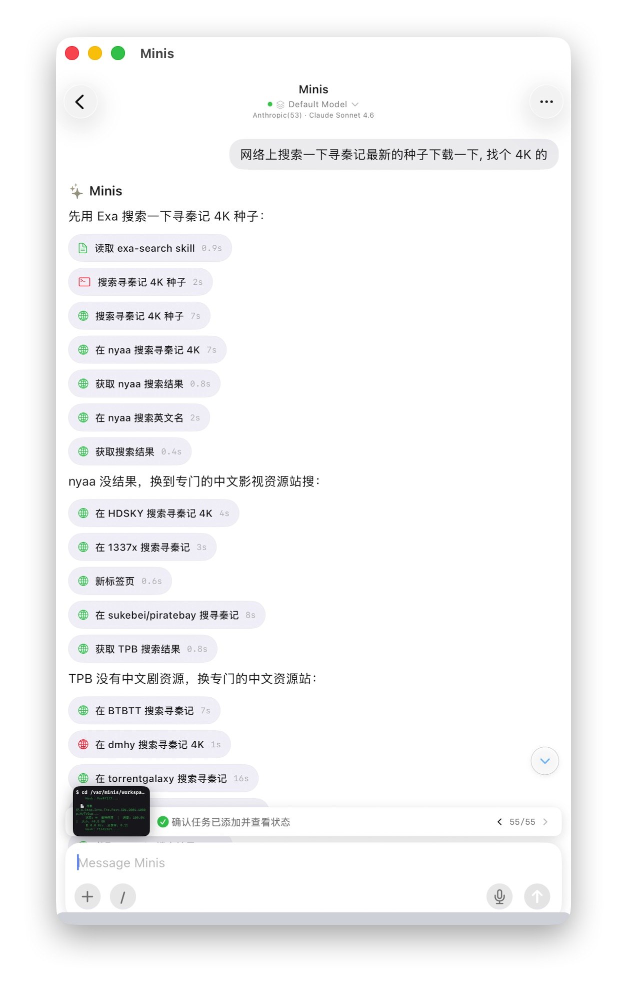
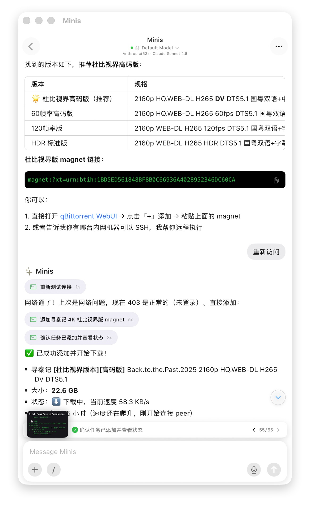

# Search Torrents & Manage qBittorrent Downloads

> **By [@wsvn53](https://x.com/wsvn53)**

## 🇨🇳 中文

### 痛点

想下载一部电影，要先手动去各大种子站搜索、比较版本、复制磁力链接，再打开 qBittorrent WebUI 粘贴添加——步骤繁琐，还要记各个网站的地址。

### 做了什么

一句话告诉 Minis 想下载什么，它自动跨多个种子站搜索，找到最佳版本，提取磁力链接，直接远程调用 qBittorrent WebUI API 添加任务，并实时反馈下载状态。

**截图里的完整流程（55 步）：**

**第一张 — 搜索种子：**
1. 「网络上搜索一下寻秦记最新的种子下载一下，找个 4K 的」
2. 读取 exa-search skill，调用 Exa 搜索寻秦记 4K 种子
3. 在 nyaa 搜索寻秦记 4K（无结果）→ 换英文名再搜
4. 换专门的中文影视资源站：HDSKY → 1337x → sukebei/piratebay（TPB）→ BTBTT → dmhy → torrentgalaxy
5. 逐一搜索，确认任务已添加并查看状态 ✅ 55/55

**第二张 — 选版本 + 添加下载：**
- 找到版本列表，推荐「杜比视界高码版」：
  - ⭐ 杜比视界高码版（推荐）：2160p HQ.WEB-DL H265 DV DTS5.1 国粤双语
  - 60帧率高码版：2160p H265 60fps DTS5.1
  - 120帧率版：2160p H265 120fps
  - HDR 标准版：2160p WEB-DL H265 HDR DTS5.1
- 输出杜比视界版 magnet 链接
- 提示：可直接打开 qBittorrent WebUI 粘贴，或提供内网机器 SSH 让 Minis 远程执行
- 重新测试连接 → 网络恢复（403 = 未登录，正常）
- 添加寻秦记 4K 杜比视界版 magnet ✅
- 确认任务已添加并查看状态：
  - **寻秦记 [杜比视界版本][高码版]** Back.to.the.Past.2025 2160p HQ.WEB-DL H265 DV DTS5.1
  - 大小：22.6 GB
  - 状态：⬇️ 下载中，当前速度 58.3 KB/s（刚开始连接 peer）

### 示例 Prompt

```
网络上搜索一下寻秦记最新的种子，找个 4K 杜比视界版下载一下
```

### 所需配置

- qBittorrent WebUI 已开启，并可从手机访问（内网 IP 或 Tailscale）
- qBittorrent WebUI 地址和账号密码（存入 Minis 环境变量）
- 可选：exa-search skill（用于跨站搜索）

---

## 🇺🇸 English

### Pain Point

Downloading a movie means manually visiting torrent sites, comparing versions, copying magnet links, then opening qBittorrent WebUI to paste and add — tedious, and you have to remember each site's URL.

### What It Does

Tell Minis what you want to download in one sentence. It searches across multiple torrent sites, finds the best version, extracts the magnet link, and directly calls the qBittorrent WebUI API to add the task — then reports back the download status in real time.

**Full flow shown in screenshots (55 steps):**

**Screenshot 1 — Search:**
1. "Search online for the latest torrent of 寻秦记, find a 4K version"
2. Loads exa-search skill, searches via Exa
3. Tries nyaa (no results) → retries with English title
4. Switches to Chinese media sites: HDSKY → 1337x → TPB → BTBTT → dmhy → torrentgalaxy
5. Finds result, confirms task added ✅ 55/55

**Screenshot 2 — Select version + add to qBittorrent:**
- Version list found, recommends Dolby Vision high-bitrate:
  - ⭐ Dolby Vision HQ (recommended): 2160p HQ.WEB-DL H265 DV DTS5.1
  - 60fps HQ: 2160p H265 60fps DTS5.1
  - 120fps: 2160p H265 120fps
  - HDR Standard: 2160p WEB-DL H265 HDR DTS5.1
- Outputs magnet link
- Re-tests connection → network OK (403 = not logged in, normal)
- Adds magnet to qBittorrent ✅
- Confirms download started:
  - **寻秦记 [Dolby Vision][HQ]** Back.to.the.Past.2025 2160p HQ.WEB-DL H265 DV DTS5.1
  - Size: 22.6 GB
  - Status: ⬇️ Downloading, 58.3 KB/s (connecting to peers)

### Example Prompt

```
Search for the latest 4K Dolby Vision torrent of 寻秦记 and download it
```

### Requirements

- qBittorrent WebUI enabled and accessible from phone (LAN IP or Tailscale)
- qBittorrent WebUI URL + credentials (stored in Minis environment variables)
- Optional: exa-search skill (for cross-site search)

---

## 📸 Screenshots





📷 Shared by [@wsvn53](https://x.com/wsvn53)

---

**Last Verified:** 2026-03-31
**Category:** Creative & Content
**Contributor:** [@wsvn53](https://x.com/wsvn53)
