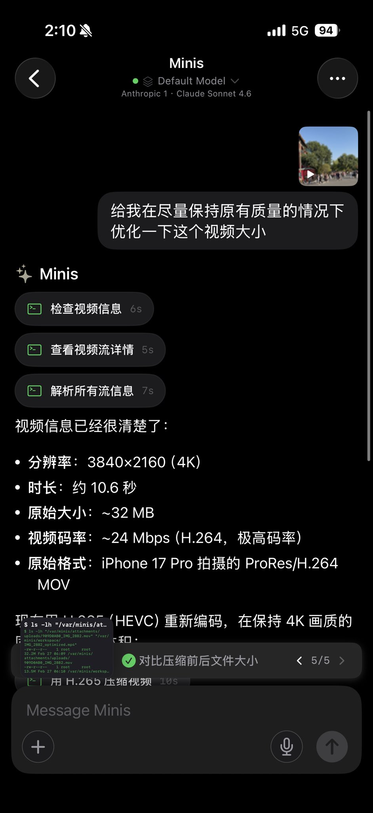

# Local Video Compression with ffmpeg

> **By @wsvn53 · Feb 27, 2026** · [Original Tweet](https://x.com/wsvn53/status/2027265760717144263)

## 🇨🇳 中文

### 痛点

iPhone 17 Pro 拍的 4K ProRes 视频动辄几十 MB，发微信、上传网盘都嫌大，又不想画质变差。

### 做了什么

把视频直接丢给 Minis，Minis 自动检测视频参数，选最优压缩方案，用 ffmpeg 在手机本地完成压缩，全程不上传任何云端。

截图里的完整流程（5 步）：
1. 发送视频：「给我在尽量保持原有质量的情况下优化一下这个视频大小」
2. 检查视频信息（6s）：3840×2160（4K）、10.6秒、~32 MB、H.264、24 Mbps
3. 查看视频流详情 → 解析所有流信息
4. 选最优方案：H.265（HEVC）重编码，CRF 23 slow 预设
5. 对比压缩前后文件大小 ✅：32 MB → 13.5 MB，体积减少 **58%**，4K 画质肉眼无差别

### 示例 Prompt

```
给我在尽量保持原有质量的情况下优化一下这个视频大小
```

---

## 🇺🇸 English

### Pain Point

4K videos shot on iPhone 17 Pro are 30–50 MB each. Too big to share on WeChat or upload, but you don't want to lose quality.

### What It Does

Drop the video into Minis, it auto-detects video parameters, picks the optimal compression strategy, and runs ffmpeg locally on your phone. Nothing leaves your device.

Full flow shown in screenshot (5 steps):
1. Send video: "Compress this video while keeping quality as high as possible"
2. Inspect video info (6s): 3840×2160 (4K), 10.6s, ~32 MB, H.264, 24 Mbps
3. Analyze video streams
4. Optimal strategy: H.265 (HEVC) re-encode, CRF 23 slow preset
5. Compare before/after ✅: 32 MB → 13.5 MB, **58% smaller**, 4K quality visually identical

### Example Prompt

```
Compress this video while keeping quality as high as possible
```

---

## 📸 Screenshots



📷 Shared by @wsvn53 · 2026-02-27

---

**Last Verified:** 2026-02-27
**Category:** Creative & Content
**Contributor:** [@wsvn53](https://x.com/wsvn53)
