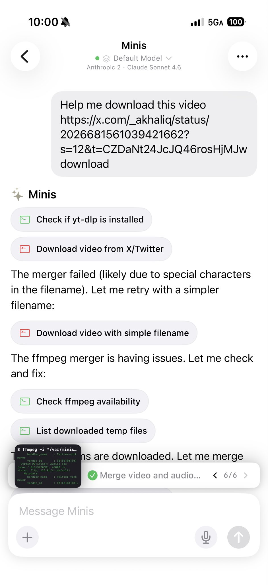

# Download X/Twitter Videos

> **By @wsvn53 · Feb 27, 2026** · [Original Tweet](https://x.com/wsvn53/status/2027261270542713040)

## 🇨🇳 中文

### 痛点

X 上的视频没有官方下载按钮，第三方下载网站要么有广告、要么失效、要么不支持高清。

### 做了什么

把 X 视频链接直接丢给 Minis，Minis 自动调用 yt-dlp 下载视频和音频流，用 ffmpeg 合并，遇到报错自己 debug 自己修，下载完直接给文件链接。

截图里的完整流程：
1. 发送 X 视频链接：「Help me download this video」
2. 检查 yt-dlp 是否已安装
3. 从 X/Twitter 下载视频（遇到文件名特殊字符报错 → 自动换简单文件名重试）
4. 检查 ffmpeg 可用性 → 列出临时文件
5. 合并视频和音频流 ✅ 6/6

### 示例 Prompt

```
Help me download this video: https://x.com/xxx/status/xxx
```

---

## 🇺🇸 English

### Pain Point

X has no official video download button. Third-party sites are full of ads, break frequently, or don't support HD.

### What It Does

Paste an X video link, Minis auto-installs yt-dlp, downloads video and audio streams, merges them with ffmpeg, auto-debugs any errors, and gives you a direct file link when done.

Full flow shown in screenshot:
1. Send X video link: "Help me download this video"
2. Check if yt-dlp is installed
3. Download from X/Twitter (filename error → auto-retry with simpler name)
4. Check ffmpeg availability → list temp files
5. Merge video and audio streams ✅ 6/6

### Example Prompt

```
Help me download this video: https://x.com/xxx/status/xxx
```

---

## 📸 Screenshots



📷 Shared by @wsvn53 · 2026-02-27

---

**Last Verified:** 2026-02-27
**Category:** Creative & Content
**Contributor:** [@wsvn53](https://x.com/wsvn53)
