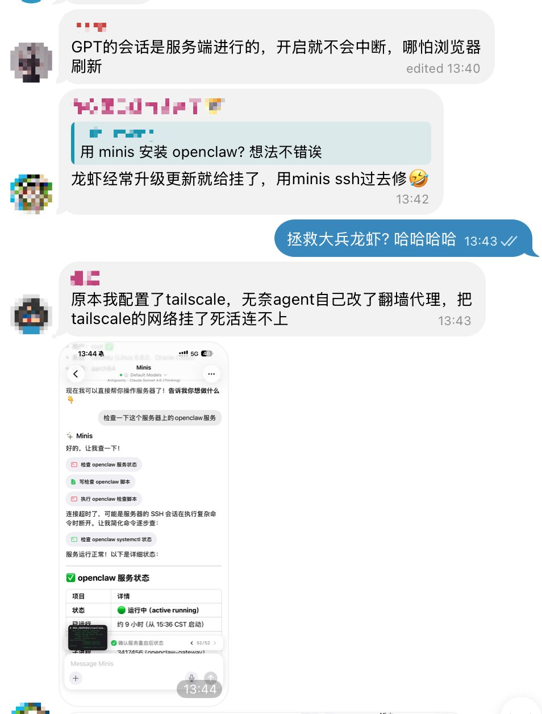

# Rescue a Crashed OpenClaw via SSH

> **By @wsvn53 · Mar 6, 2026** · [Original Tweet](https://x.com/wsvn53/status/2029852301998051847)

## 🇨🇳 中文

### 痛点

OpenClaw（龙虾）升级后经常挂掉——tailscale 断了、服务崩了、SSH 连不上。以前要么找人上门修，要么干等。

### 做了什么

用 Minis SSH 远程进入服务器，自动诊断 OpenClaw 服务状态，发现问题后一键修复，全程不需要打开电脑。

> 龙虾经常升级更新就给挂了，用 minis ssh 过去修 🤣

截图里的完整流程：
1. 对话："检查一下这个服务器上的openclaw服务"
2. Minis 自动：检查 openclaw 服务状态 → 写检查脚本 → 执行脚本
3. 输出 `openclaw 服务状态：✅ 运行中 (active running)`，运行 9 小时，52/52 步完成

### 示例 Prompt

```
SSH 连接到我的服务器，检查一下 OpenClaw 服务状态，如果挂了帮我重启
```

### 所需配置

- SSH 密钥或密码（存入 Minis 环境变量）
- 服务器 IP / 域名

---

## 🇺🇸 English

### Pain Point

OpenClaw (a.k.a. "the lobster") crashes after every update — Tailscale drops, the service dies, SSH tunnels break. Used to require someone physically on-site or hours of waiting.

### What It Does

SSH into the server from your iPhone via Minis, automatically diagnose the OpenClaw service, and fix it — no laptop needed.

> "OpenClaw keeps dying after updates, just SSH in with Minis to fix it 🤣"

Full flow shown in screenshot:
1. Prompt: "Check the OpenClaw service on this server"
2. Minis auto-runs: check service status → write diagnostic script → execute
3. Output: `openclaw service: ✅ active running`, uptime 9h, 52/52 steps done

### Example Prompt

```
SSH into my server and check the OpenClaw service status. If it's down, restart it.
```

### Requirements

- SSH key or password (stored in Minis environment variables)
- Server IP / hostname

---

## 📸 Screenshots



📷 Shared by @wsvn53 · 2026-03-06

---

**Last Verified:** 2026-03-06
**Category:** Developer Tools
**Contributor:** [@wsvn53](https://x.com/wsvn53)
