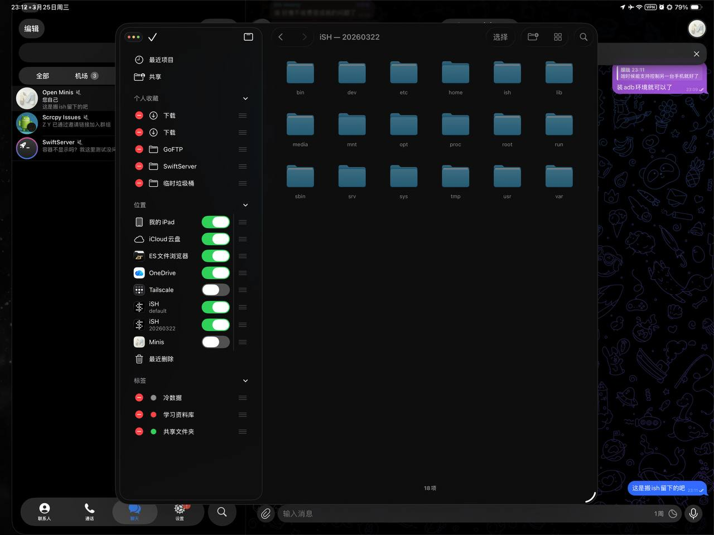
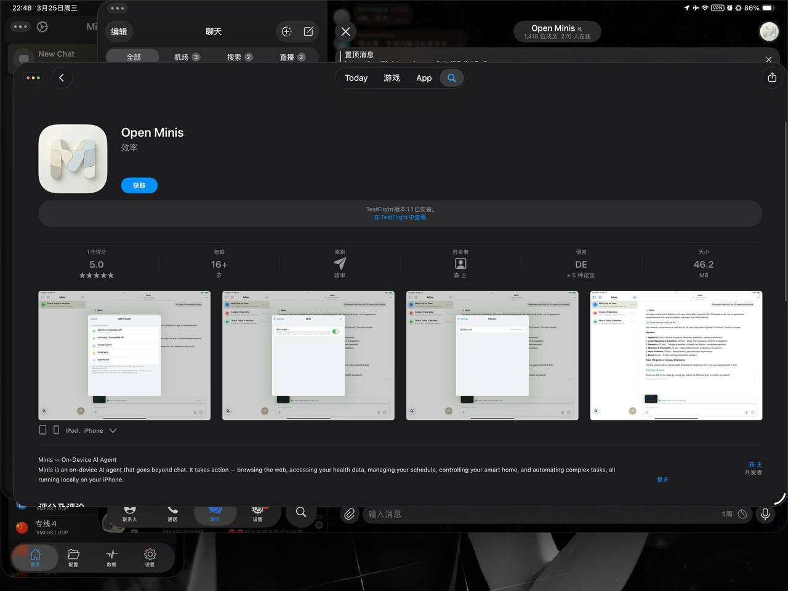

# iPad 实时监控 Minis 执行过程（网页仪表板）

**Real-Time Execution Monitor on iPad (Web Dashboard)**

> 💬 *From the Open Minis community — shared by **king 华** on 2026-03-27*

---

## 🎯 痛点 / Pain Point

**中文：** Minis 内置的执行查看器在 iPad 上无法分屏或自由移动，长任务监控不方便。

**English:** The built-in execution viewer can't be split-screened or freely moved on iPad, making long-task monitoring inconvenient.

---

## 💡 做了什么 / What It Does

**中文：** 在 iPad 上通过监听 Minis 的执行过程，实时生成一个可移动、可分屏查看的网页仪表板，比内置执行查看器更灵活，适合长任务监控。

**English:** On iPad, monitors Minis' execution in real time and generates a live web dashboard that can be moved and viewed in split-screen — more flexible than the built-in execution viewer for long-running tasks.

---

## 🛠 所用技能 / Skills Used

| Skill | Purpose |
|-------|---------|
| `custom (shell + python http server)` | — |

---

## 💬 示例 Prompt / Example Prompt

**中文：**
```
帮我创建一个实时监控脚本，监听当前任务的执行过程，生成一个可以在浏览器中查看的实时网页仪表板。
```

**English:**
```
Create a real-time monitoring script that listens to the current task's execution and generates a live web dashboard viewable in a browser.
```

---


## 📸 截图 / Screenshots


*📷 Shared by **king 华** · 2026-03-25*


*📷 Shared by **king 华** · 2026-03-25*

## ⚙️ 配置要求 / Requirements

- [ ] iPad 推荐（手机屏幕太小）
- [ ] Python + http.server（Minis 内置）

---

## 🏷 标签 / Tags

`ipad` `monitoring` `dashboard` `developer` `debug`

---

## 👤 贡献者 / Contributor

来自 Open Minis Telegram 社区 / From the Open Minis Telegram community

原始分享者 / Original sharer: **king 华**

---

## 📅 验证时间 / Last Verified

2026-03-27
