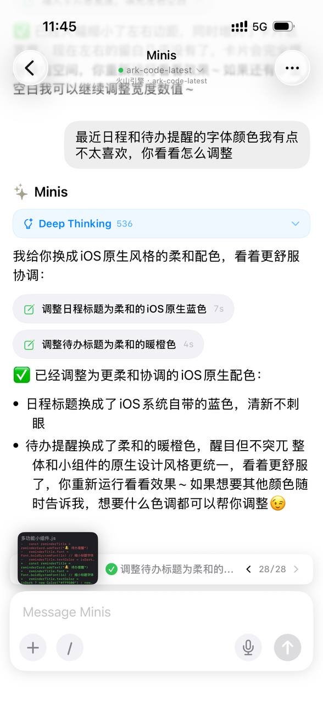
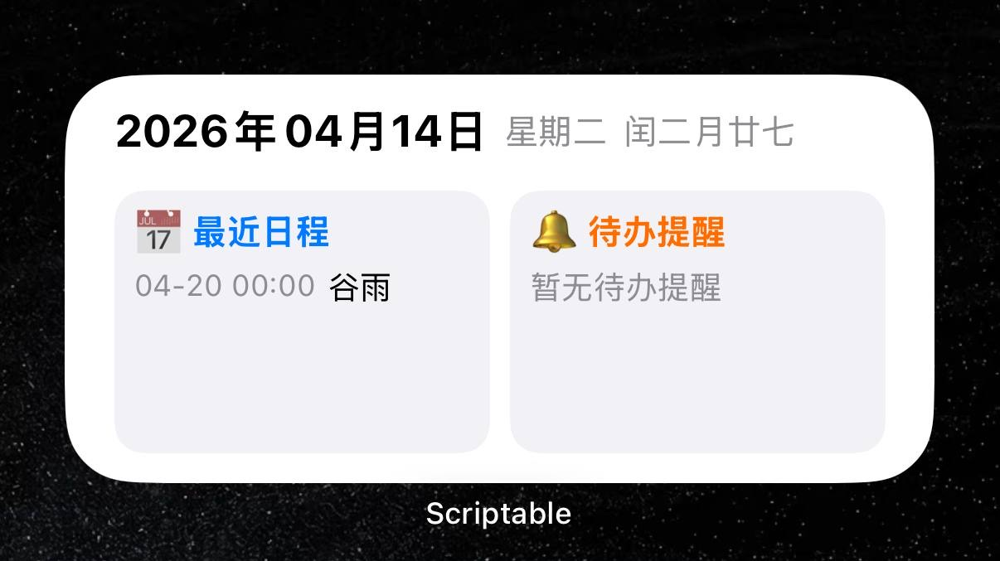

# Build a Scriptable Widget with AI — No Laptop Needed

> **By @XIN · Apr 14, 2026** · Shared in Open Minis Community

## 🇨🇳 中文

### 痛点

想做一个 iOS 主屏小组件，但 Scriptable 只是个代码编辑器——你还是得自己写 JavaScript，还要查文档、调样式、处理深色模式，门槛不低。

### 做了什么

用 Minis 挂载 Scriptable 的文件夹，直接把 AI 写好的小组件代码放进去，Scriptable 立刻就能识别并显示。全程不需要打开电脑，不需要手动复制粘贴。

完整流程：

1. 在 Minis 中挂载 Scriptable 目录（`mount/scriptable`）
2. 描述需求：日历 + 提醒事项双栏小组件，支持大中小三种尺寸，白天/黑夜自动切换
3. Minis 查阅 Scriptable 官方文档（`docs.scriptable.app`），理解 API
4. 生成完整 JavaScript 代码，直接写入挂载目录
5. 打开 Scriptable → 小组件已出现，添加到主屏即可显示
6. 不满意？直接说"日程标题颜色改成 iOS 原生蓝，待办改成暖橙色"，Minis 秒改，重新运行即可

### 最终效果

- 顶部一行：公历日期 + 星期 + 农历（闰二月廿七）
- 左侧：最近日程，显示具体事项名和时间（04-20 谷雨）
- 右侧：待办提醒，过期事项自动显示红色
- 点击对应区块，直接跳转到日历 / 提醒事项 App
- 自动适配大中小尺寸，跟随系统深色模式切换

### 示例 Prompt

```
我要做一个 Scriptable 小组件，文档在 https://docs.scriptable.app/，
文件路径在 mount/scriptable。

要求：
- 自动适配 iOS 大中小三种尺寸
- 最上面显示公历日期、星期和农历
- 左侧显示最近日程（名称 + 时间）
- 右侧显示待办提醒（过期的用红色标注）
- 日程和提醒只显示未来两周内容
- 点击可跳转到对应 App
- 支持白天/黑夜自动切换
```

### 所需配置

- 在 iOS 文件 App 中将 Scriptable 目录共享给 Minis（挂载为 `mount/scriptable`）
- 安装 [Scriptable](https://apps.apple.com/app/scriptable/id1405459188)（免费）

---

## 🇺🇸 English

### Pain Point

You want a custom iOS home screen widget, but Scriptable is just a code editor — you still have to write JavaScript yourself, read API docs, handle dark mode, and tune layout sizes. The barrier is real.

### What It Does

Mount the Scriptable folder in Minis, let AI write the widget code, and drop it straight into the directory. Scriptable instantly detects the new script — no laptop, no copy-paste.

Full flow:

1. Mount the Scriptable directory in Minis (`mount/scriptable`)
2. Describe what you want: dual-panel widget with calendar + reminders, all 3 sizes, auto dark mode
3. Minis reads the official Scriptable docs (`docs.scriptable.app`) to understand the API
4. Generates complete JavaScript, writes it directly into the mounted directory
5. Open Scriptable → widget appears immediately, add to home screen and it's live
6. Not happy with the colors? Say "make the calendar title iOS blue and reminders warm orange" — Minis edits the file, re-run to see the update

### Final Result

- Top row: Gregorian date + weekday + Chinese lunar date
- Left panel: upcoming calendar events with name and time
- Right panel: reminders list; overdue items shown in red
- Tap a panel to jump directly into Calendar or Reminders app
- Auto-adapts to small / medium / large widget sizes
- Follows system dark mode automatically

### Example Prompt

```
I want to build a Scriptable widget. Docs at https://docs.scriptable.app/,
file path is mount/scriptable.

Requirements:
- Auto-adapts to iOS small / medium / large sizes
- Top row: date, weekday, and Chinese lunar calendar
- Left panel: upcoming calendar events (name + time)
- Right panel: reminders (overdue items in red)
- Show only events within the next 2 weeks
- Tapping opens the corresponding app
- Supports auto dark/light mode
```

### Requirements

- Share the Scriptable folder to Minis via iOS Files app (mounted as `mount/scriptable`)
- Install [Scriptable](https://apps.apple.com/app/scriptable/id1405459188) (free)

---

## 📸 Screenshots

**Step 1 · 描述需求，Minis 查阅文档并生成代码**


**Step 2 · 口头调色，Minis 直接改文件**



**Step 3 · 最终效果：主屏小组件**



📷 Shared by @XIN · 2026-04-14

---

**Last Verified:** 2026-04-14
**Category:** Developer Tools / Productivity
**Contributor:** [@XIN](https://x.com/XIN)
