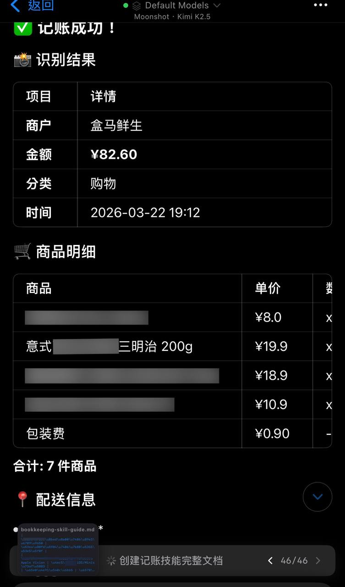

# 拍小票自动记账

**Photo a Receipt → Auto-Log Expense**

> 💬 *From **Zigzag** · 2026-03-30 (via DM)*

---

## 🎯 痛点 / Pain Point

**中文：** 购物后手动记账太麻烦：打开记账 App、输入商户、金额、分类、日期……每次都懒得做，导致账单一团乱。

**English:** Manual expense logging after shopping is a chore: open the app, enter merchant, amount, category, date… You skip it every time, and your finances stay a mess.

---

## 💡 做了什么 / What It Does

**中文：** 拍一张购物小票发给 Minis，它调用 Apple Vision 识别小票内容，提取商户名称、总金额、商品明细、消费时间，自动归类（购物/餐饮/交通等），完成记账并输出结构化账单。

实测效果（盒马鲜生小票）：
- ✅ 正确识别商户：盒马鲜生
- ✅ 金额：¥82.60（7件商品）
- ✅ 自动归类：购物
- ✅ 识别打折商品，折后价准确
- 💡 使用 Apple Vision 本地识别，无需联网，暗光环境正常开灯下识别准确

**English:** Take a photo of a receipt and send it to Minis. It uses Apple Vision to OCR the receipt, extracts merchant name, total amount, item breakdown, and timestamp, auto-categorizes the expense (shopping/dining/transport, etc.), and outputs a structured expense record.

Real test (Hema Fresh receipt):
- ✅ Merchant: 盒马鲜生 (Hema Fresh)
- ✅ Amount: ¥82.60 (7 items)
- ✅ Auto-category: Shopping
- ✅ Correctly identified discounted items with final price
- 💡 Uses Apple Vision for local OCR — no network needed, works well under normal indoor lighting

---

## 🛠 所用技能 / Skills Used

| Skill | Purpose |
|-------|---------|
| Built-in (Apple Vision) | 本地 OCR 识别小票文字 / Local OCR of receipt text |
| Built-in (shell) | 解析数据、生成记账文档 / Parse data, generate expense log |

---

## 💬 示例 Prompt / Example Prompt

**中文：**
```
（附上小票照片）
帮我记账。
```

**English:**
```
(Attach receipt photo)
Log this expense for me.
```

---

## 📸 截图 / Screenshots



*📷 Shared by **Zigzag** · 2026-03-30 — 拍盒马鲜生小票，自动识别 7 件商品明细、¥82.60 总额、归类为购物*

---

## ⚙️ 配置要求 / Requirements

- [ ] 无需额外配置，Apple Vision 为内置能力
- [ ] 建议正常室内光线拍摄，避免强烈反光

---

## 💡 Tips

- 支持含打折商品的小票，折后价可准确识别
- 可要求 Minis 将记账数据追加写入 CSV 文件，长期积累后做月度分析
- 也可以直接拍外卖订单截图，效果同样准确

---

## 👤 贡献者 / Contributor

来自 Open Minis Telegram 社区 / From the Open Minis Telegram community

原始分享者 / Original sharer: **Zigzag**

---

## 📅 Last Verified

2026-03-30
