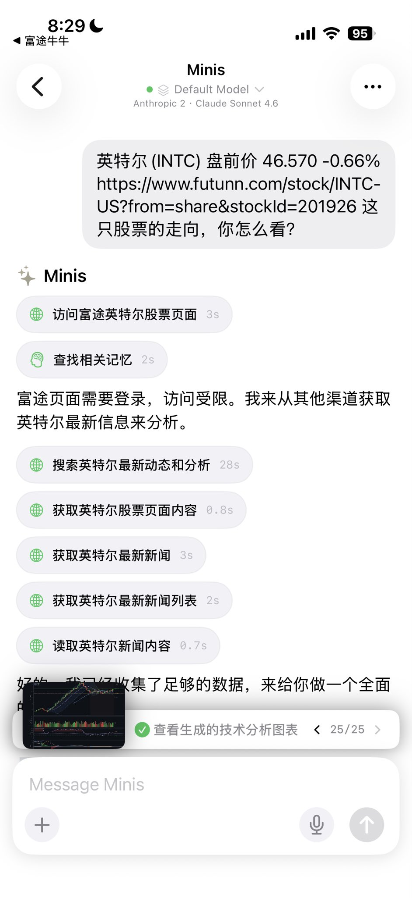
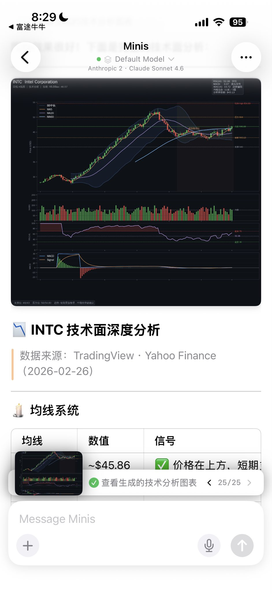

# Stock Technical Analysis with Charts

> **By @wsvn53 · Feb 27, 2026** · [Original Tweet](https://x.com/wsvn53/status/2027333621393334582)

## 🇨🇳 中文

### 痛点

想看一只股票的技术面，要打开好几个 App，手动查 K 线、均线、MACD，还要自己判断信号。

### 做了什么

把富途股票链接或股票名称丢给 Minis，Minis 自动访问富途 / Yahoo Finance / TradingView 多源抓取数据，编写分析脚本，生成完整技术面图表和研判报告。

截图里的完整流程（25 步）：
1. 发送：「英特尔 (INTC) 盘前价 46.570，这只股票走向你怎么看？」
2. 访问富途英特尔股票页面（富途需登录，自动切换其他源）
3. 搜索英特尔最新动态 → 获取股票页面 → 获取最新新闻（×4步）
4. 编写分析脚本，生成图表：
   - K 线图 + 布林带 + MA5/MA20/MA60
   - 成交量柱状图
   - RSI 指标
   - MACD + Signal 线
5. 输出 INTC 技术面深度分析报告 ✅ 25/25
   - 数据来源：TradingView · Yahoo Finance
   - 均线系统：MA5 ~$45.86，价格在上方 ✅ 短期看多信号

> "真棒，亏钱亏得也有理有据😭"

### 示例 Prompt

```
英特尔 盘前价 46.570，这只股票走向你怎么看？
```

---

## 🇺🇸 English

### Pain Point

Checking a stock's technicals means opening multiple apps, manually checking candlestick charts, moving averages, MACD — then interpreting the signals yourself.

### What It Does

Share a stock ticker or Futu link with Minis. It scrapes Futu / Yahoo Finance / TradingView, writes an analysis script, and generates a full technical chart + research report.

Full flow shown in screenshots (25 steps):
1. Send: "Intel (INTC) pre-market 46.570, what's your take on this stock?"
2. Access Futu Intel page (login required → auto-switch to other sources)
3. Search latest Intel news → fetch stock page → fetch news (×4 steps)
4. Generate charts:
   - Candlestick + Bollinger Bands + MA5/MA20/MA60
   - Volume bars
   - RSI
   - MACD + Signal line
5. Output INTC technical analysis report ✅ 25/25
   - Sources: TradingView · Yahoo Finance
   - MA system: MA5 ~$45.86, price above → short-term bullish signal

> "Great, at least I lose money with solid reasoning 😭"

### Example Prompt

```
Intel pre-market price 46.570, what's your take on this stock's direction?
```

---

## 📸 Screenshots





📷 Shared by @wsvn53 · 2026-02-27

---

**Last Verified:** 2026-02-27
**Category:** Finance & Tracking
**Contributor:** [@wsvn53](https://x.com/wsvn53)
