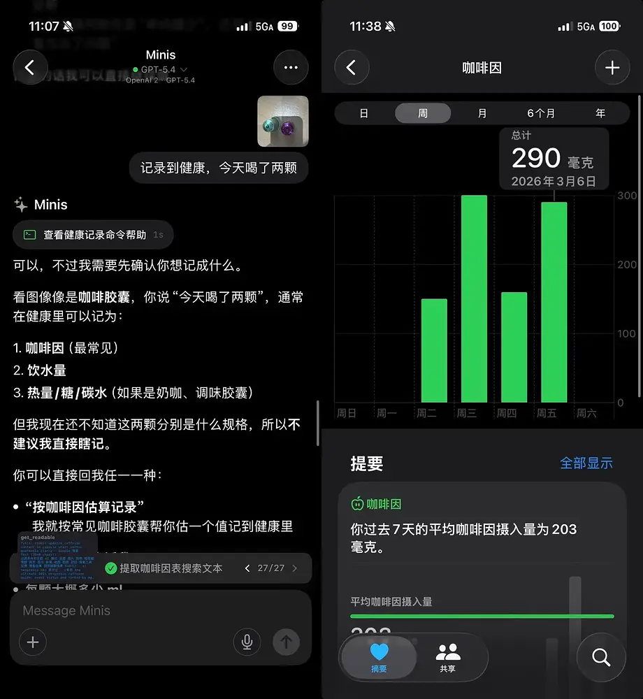

# 拍照咖啡自动记录咖啡因摄入

**Photo a Coffee → Auto-Log Caffeine Intake to HealthKit**

> 💬 *From [@wsvn53](https://x.com/wsvn53) / appinn.com · 2026-03-28*

---

## 🎯 痛点 / Pain Point

**中文：** 想追踪每天的咖啡因摄入，但手动打开健康 App 记录太麻烦，每次都懒得做。

**English:** You want to track your daily caffeine intake, but manually logging it in the Health app is too much friction — so you never actually do it.

---

## 💡 做了什么 / What It Does

**中文：** 拍一张咖啡（或咖啡胶囊）的照片发给 Minis，它识别咖啡种类和数量，估算咖啡因含量，调用 `apple-healthkit` 自动写入健康数据，形成完整的咖啡因追踪闭环。

**English:** Take a photo of your coffee (or coffee capsules) and send it to Minis. It identifies the coffee type and quantity, estimates caffeine content, and calls `apple-healthkit` to log the data automatically — a complete caffeine tracking loop.

---

## 🛠 所用技能 / Skills Used

| Skill | Purpose |
|-------|---------|
| Built-in (Vision) | 识别咖啡种类和数量 / Identify coffee type and quantity |
| Built-in (`apple-healthkit`) | 写入咖啡因数据 / Log caffeine data to HealthKit |

---

## 💬 示例 Prompt / Example Prompt

**中文：**
```
（附上咖啡照片）
帮我记录这杯咖啡的咖啡因摄入。
```

**English:**
```
(Attach coffee photo)
Log the caffeine intake for this coffee.
```

---


## 📸 截图 / Screenshots



*📷 拍摄咖啡胶囊 → Minis 识别并记录咖啡因 → Apple Health 显示每周趋势 · @wsvn53 via appinn.com · 2026-03-06*

## ⚙️ 配置要求 / Requirements

- [ ] HealthKit 写入权限已授予 Minis

---

## 💡 Tips

- 结合健康数据分析，可以观察咖啡因摄入与睡眠质量的关联
- 也可以直接说"帮我记录两颗雀巢胶囊咖啡"，无需拍照

---

## 👤 贡献者 / Contributor

[@wsvn53](https://x.com/wsvn53) · [appinn.com](https://www.appinn.com/iphone-automation-11-real-use-cases/)

## 📅 Last Verified

2026-03-28
