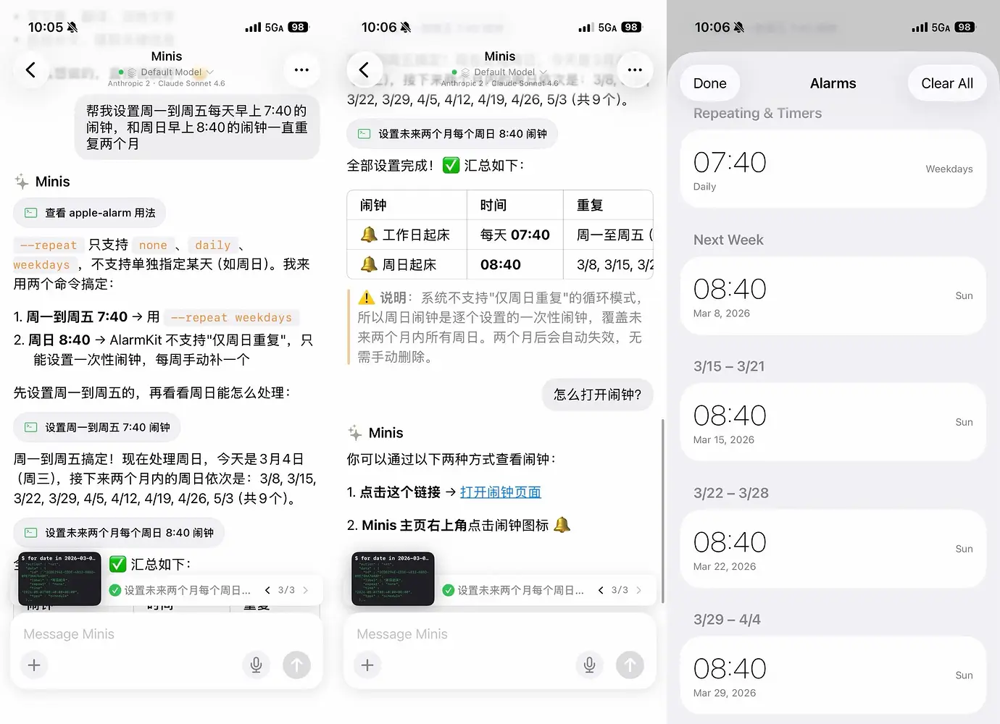

# 批量设置复杂闹钟

**Batch Set Complex Alarm Schedules**

> 💬 *From appinn.com · 2026-03-28*

---

## 🎯 痛点 / Pain Point

**中文：** 需要设置多个不同时间、不同重复规则的闹钟（如工作日不同时段、特定日期），手动一个个设置既费时又容易出错。

**English:** Setting multiple alarms with different times and repeat rules (weekday schedules, specific dates) one by one is slow and error-prone.

---

## 💡 做了什么 / What It Does

**中文：** 把闹钟需求描述给 Minis，它一次性批量创建所有闹钟，包括复杂的重复规则，无需手动逐一操作。

**English:** Describe your alarm requirements to Minis, and it creates all alarms in one batch — including complex repeat rules — without any manual tapping.

---

## 🛠 所用技能 / Skills Used

| Skill | Purpose |
|-------|---------|
| Built-in (`apple-alarm`) | 批量创建闹钟 / Batch create alarms |

---

## 💬 示例 Prompt / Example Prompt

**中文：**
```
帮我设置以下闹钟：
- 周一到周五 6:30，标签"起床"
- 周一到周五 7:00，标签"出门"
- 周六周日 8:30，标签"周末起床"
- 每天 22:30，标签"准备睡觉"
```

**English:**
```
Set the following alarms for me:
- Mon–Fri 6:30 AM, label "Wake up"
- Mon–Fri 7:00 AM, label "Leave home"
- Sat–Sun 8:30 AM, label "Weekend wake up"
- Daily 10:30 PM, label "Get ready for bed"
```

---


## 📸 截图 / Screenshots



*📷 一句话批量设置工作日+周日闹钟，Minis 自动处理复杂重复规则 · @wsvn53 via appinn.com · 2026-03-05*

## ⚙️ 配置要求 / Requirements

- [ ] iOS 26+（apple-alarm 需要 AlarmKit 支持）
- [ ] 无需额外配置

---

## 👤 贡献者 / Contributor

[appinn.com](https://www.appinn.com/iphone-automation-11-real-use-cases/)

## 📅 Last Verified

2026-03-28
