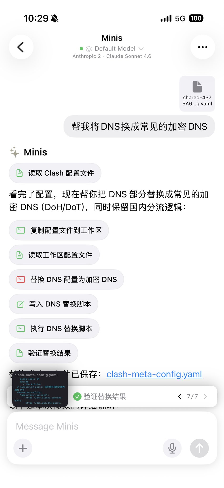

# Edit Clash Config Without Touching YAML

> **By @wsvn53 · Feb 27, 2026** · [Original Tweet](https://x.com/wsvn53/status/2027254629344649333)

## 🇨🇳 中文

### 痛点

Clash 配置文件动辄几百行 YAML，改个 DNS 要手动找位置、记语法，一不小心缩进错了就全挂。

### 做了什么

把 Clash 配置文件直接丢给 Minis，一句话搞定——Minis 读取配置、替换 DNS 为 DoH/DoT 加密 DNS，同时保留国内分流逻辑，改完给出变更说明和新文件。

截图里的完整流程（7 步）：
1. 分享 `.yaml` 配置文件到 Minis
2. 「帮我将 DNS 换成常见的加密 DNS」
3. 读取 Clash 配置文件
4. 复制配置文件到工作区
5. 替换 DNS 配置为加密 DNS（DoH/DoT）
6. 写入 DNS 替换脚本 → 执行
7. 验证替换结果 ✅ 7/7，输出新文件 `clash-meta-config.yaml`

### 示例 Prompt

```
帮我把这个 Clash 配置里的 DNS 换成常见的加密 DNS，保留国内分流逻辑
```

---

## 🇺🇸 English

### Pain Point

Clash config files are hundreds of lines of YAML. Editing DNS settings means hunting for the right section, remembering the syntax, and risking a broken config from a single indentation error.

### What It Does

Drop the Clash config file into Minis, say what you want — Minis reads the config, replaces DNS with DoH/DoT encrypted DNS while preserving China routing rules, then gives you a change summary and the new file. Zero YAML editing required.

Full flow shown in screenshot (7 steps):
1. Share `.yaml` config to Minis
2. "Help me replace DNS with common encrypted DNS"
3. Read Clash config file
4. Copy config to workspace
5. Replace DNS config with encrypted DNS (DoH/DoT)
6. Write & execute DNS replacement script
7. Verify result ✅ 7/7, output `clash-meta-config.yaml`

### Example Prompt

```
Replace the DNS in this Clash config with common encrypted DNS (DoH/DoT), keep the China routing rules intact
```

---

## 📸 Screenshots



📷 Shared by @wsvn53 · 2026-02-27

---

**Last Verified:** 2026-02-27
**Category:** Productivity & Automation
**Contributor:** [@wsvn53](https://x.com/wsvn53)
