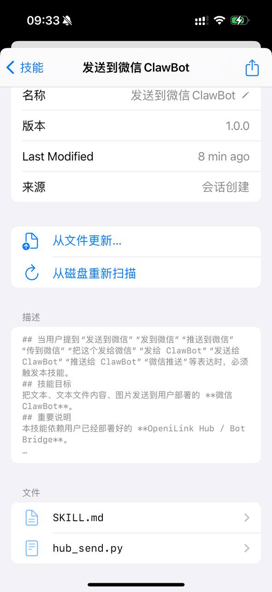

# 每日早报自动推送到微信

**Daily Briefing Auto-Push to WeChat**

> 💬 *From the Open Minis community — shared by **meng nimen** on 2026-03-25*

---

## 🎯 痛点 / Pain Point

**中文：** 每天要分别打开天气、新闻、日历等多个 App 查看信息，碎片化且耗时。

**English:** Checking weather, news, and calendar separately every morning is fragmented and time-consuming.

---

## 💡 做了什么 / What It Does

**中文：** 在 iPad 上用 Minis 定时获取天气、新闻等信息，通过 openilink-hub 中间件自动推送到手机微信，实现每日信息免手动查看。

**English:** Uses Minis on iPad with a scheduled task to fetch weather and news, then pushes the daily briefing to WeChat via the openilink-hub middleware — no manual checking needed.

---

## 🛠 所用技能 / Skills Used

| Skill | Purpose |
|-------|---------|
| `built-in (apple-weather)` | — |
| `Shortcuts automation` | — |

---

## 💬 示例 Prompt / Example Prompt

**中文：**
```
获取今天的天气预报和最新科技新闻，整理成早报格式，然后通过 openilink-hub 推送到我的微信。
```

**English:**
```
Fetch today's weather forecast and top tech news, format as a daily briefing, then push it to my WeChat via openilink-hub.
```

---


## 📸 截图 / Screenshots



*📷 Shared by **meng nimen** · 2026-03-25* — 发送到微信 ClawBot skill 配置

## ⚙️ 配置要求 / Requirements

- [ ] openilink-hub 已部署并配置微信推送
- [ ] iOS 快捷指令设置定时触发
- [ ] 地理位置权限（天气）

---

## 🏷 标签 / Tags

`automation` `wechat` `daily-briefing` `push-notification`

---

## 👤 贡献者 / Contributor

来自 Open Minis Telegram 社区 / From the Open Minis Telegram community

原始分享者 / Original sharer: **meng nimen**

---

## 📅 验证时间 / Last Verified

2026-03-25
