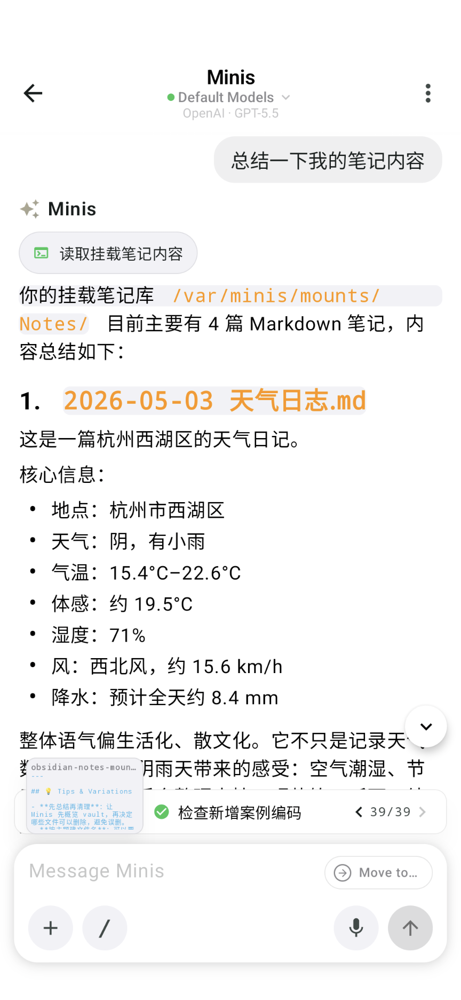
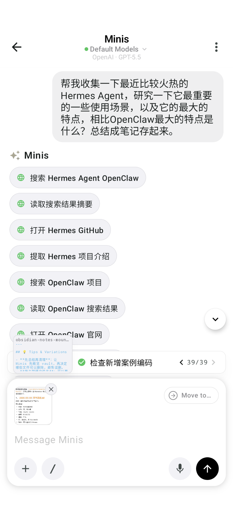
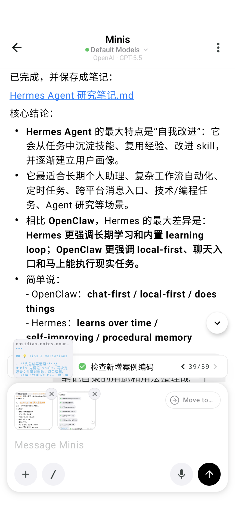
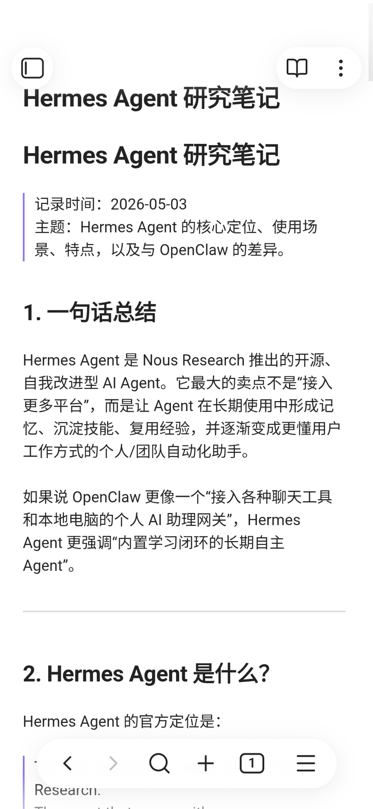

# Mount Obsidian Vault as a Minis Knowledge Workspace

**把 Obsidian 笔记库挂载到 Minis，变成可读写的 AI 知识工作区**

> 💬 *Real-world workflow: mount an Obsidian vault into Minis, then ask Minis to summarize, clean up, research, and write structured notes directly back into the vault.*

---

## 🎯 痛点 / Pain Point

**中文：** Obsidian 很适合长期沉淀知识，但移动端整理笔记仍然很麻烦：碎片笔记要手动归档，网页资料要手动复制整理，重复的测试笔记要自己清理。AI 聊天里生成的内容也常常停留在聊天记录中，没有进入真正的知识库。

**English:** Obsidian is great for long-term knowledge management, but organizing notes on mobile is still tedious: rough notes need cleanup, web research needs manual copying, test files need pruning, and AI-generated summaries often stay trapped in chat instead of becoming part of your real vault.

---

## 💡 做了什么 / What It Does

**中文：** 通过 Minis 的外部文件夹挂载能力，把 Obsidian vault 挂载到 `/var/minis/mounts/Notes/`。之后 Minis 可以像操作本地文件一样读取、总结、删除、改写和新建 Markdown 笔记。用户只需要用自然语言说：

- “看看我的挂载笔记有哪些”
- “总结一下我的笔记内容”
- “删掉那些测试的毫无意义的笔记”
- “帮我研究 Hermes Agent，整理成笔记存起来”

Minis 会直接扫描 Obsidian 目录，处理 Markdown 文件，并把新笔记写回 vault，Obsidian 里立即可见。

**English:** Use Minis' external folder mounting to mount an Obsidian vault at `/var/minis/mounts/Notes/`. Minis can then read, summarize, delete, edit, and create Markdown notes just like local files. You can simply ask in natural language, and the result is written back to the vault where Obsidian can see it immediately.

---

## 🛠 所用技能 / Skills Used

| Skill | Purpose |
|-------|---------|
| Built-in external folder mount | Mount the Obsidian vault into Minis |
| Built-in Linux shell + file tools | List, read, delete, edit, and create Markdown files |
| Built-in browser/search | Research topics and collect sources before writing notes |
| Built-in Markdown writing | Save structured notes directly into the vault |

---

## 📋 使用步骤 / How to Use

1. **准备 Obsidian vault** — 在手机本地或云同步目录里准备一个 Obsidian 笔记库，例如 `Notes/`。
2. **在 Minis 挂载目录** — 打开 Minis 设置里的 external folder mounting，把这个 Obsidian vault 挂载进 Minis。
3. **确认路径** — Minis 会在 `/var/minis/mounts/` 下看到挂载目录，例如 `/var/minis/mounts/Notes/`。
4. **让 Minis 扫描笔记** — 直接问：“看看我的挂载的笔记有哪些”。
5. **让 Minis 总结或清理** — 例如：“总结一下我的笔记内容”“删掉测试笔记”。
6. **让 Minis 写入新笔记** — 例如：“帮我收集 Hermes Agent 的资料，总结成笔记存起来”。
7. **回到 Obsidian 查看** — 新建或修改后的 `.md` 文件会出现在 Obsidian vault 中。

---

## 💬 示例 Prompt / Example Prompts

**列出 vault 中的笔记：**

```text
看看我的挂载的笔记有哪些
```

**总结现有笔记：**

```text
总结一下我的笔记内容
```

**清理无意义测试笔记：**

```text
删掉那些测试的毫无意义的笔记。
```

**研究一个主题并保存到 Obsidian：**

```text
帮我收集一下最近比较火热的 Hermes Agent，研究一下它最重要的一些使用场景，以及它的最大的特点，相比 OpenClaw 最大的特点是什么？总结成笔记存起来。
```

---

## 📤 预期结果 / Expected Output

Minis 会直接操作 Obsidian vault 里的 Markdown 文件，例如：

- 列出当前 vault 中的笔记文件
- 阅读并总结已有笔记内容
- 删除用户确认不要的测试文件
- 抓取网页资料并整理成结构化 Markdown
- 将新笔记保存为 `Hermes Agent 研究笔记.md`
- 在聊天里返回可点击的 Minis 文件链接
- 回到 Obsidian 后可以看到同一份新笔记

Typical result:

```text
已完成，并保存成笔记：Hermes Agent 研究笔记.md
```

---

## 📸 截图 / Screenshots

Minis can read the mounted Obsidian vault and summarize existing notes:



Minis can research a topic from the web while keeping the final destination as the mounted vault:



After the research is complete, Minis saves the Markdown note directly into the vault:



The same Markdown note is immediately visible in Obsidian:



---

## ⚙️ 配置要求 / Requirements

- [ ] Minis 支持 external folder mounting
- [ ] 已在系统文件选择器中授权 Minis 访问 Obsidian vault
- [ ] Obsidian vault 中的笔记以 Markdown `.md` 文件保存
- [ ] 如需联网研究主题，需要 Minis 浏览器/网络访问可用

---

## 💡 Tips & Variations

- **先总结再清理**：让 Minis 先概览 vault，再决定哪些文件可以删除，避免误删。
- **按主题建文件名**：可以要求 Minis 使用固定命名规则，如 `YYYY-MM-DD 主题.md`。
- **适合资料研究**：把“搜索 → 阅读 → 提炼 → 存 Markdown”的流程直接变成 Obsidian 入库流程。
- **适合移动端知识管理**：不用在手机上反复复制粘贴，Minis 可以直接写入 vault。
- **谨慎删除**：删除前可以要求 Minis 先列出候选文件并等待确认。

---

## 👤 贡献者 / Contributor

Submitted by: Open Minis community

---

## 📅 Last Verified

2026-05
