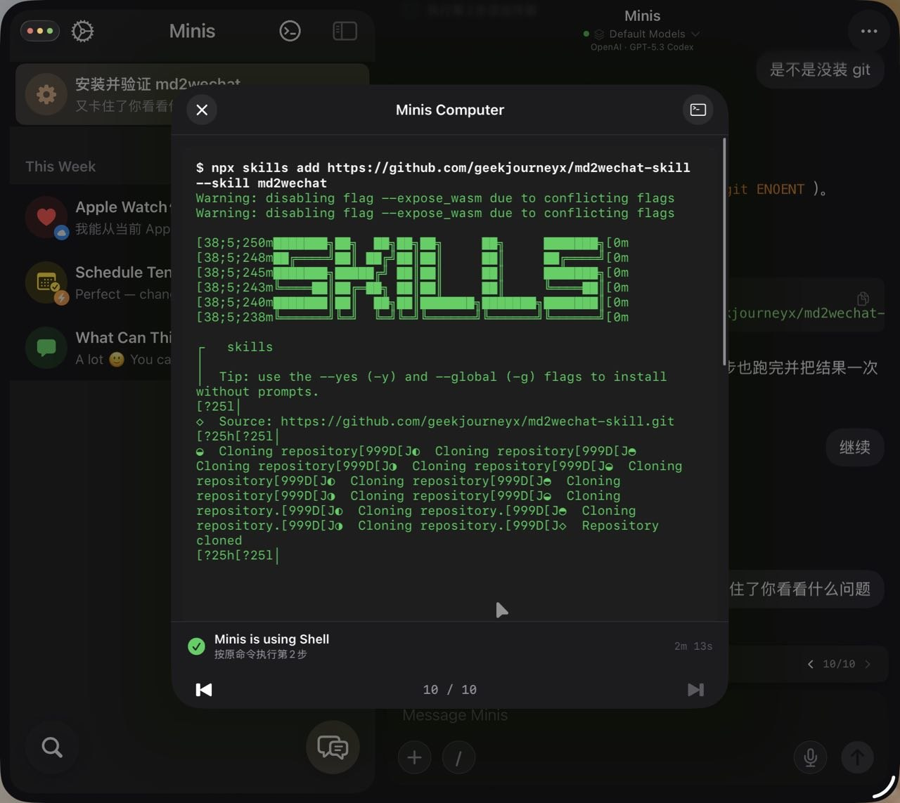
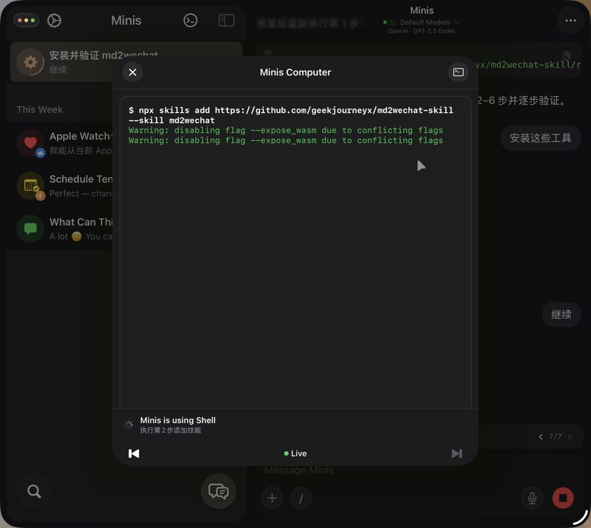

# 用快捷指令定时触发 Minis 任务

**Use iOS Shortcuts to Schedule Minis Tasks**

> 💬 *From the Open Minis community — shared by **꙳ⁿ⃞̣ᵉ⃞̣ᵏ⃞̣ᵒ⃞̣⬞🐾 / Eth Hwang** on 2026-03-22*

---

## 🎯 痛点 / Pain Point

**中文：** 想让 Minis 每天自动执行任务，但不想手动打开 App 触发。

**English:** Want Minis to run tasks automatically every day without manually opening the app.

---

## 💡 做了什么 / What It Does

**中文：** 通过 iOS 快捷指令定时触发 Minis 执行任务（如每日早报、定时健康检查），实现无需手动打开 App 的全自动化工作流。

**English:** Use iOS Shortcuts automations to trigger Minis tasks on a schedule (daily briefing, health check, etc.) — fully automated workflows without manually opening the app.

---

## 🛠 所用技能 / Skills Used

| Skill | Purpose |
|-------|---------|
| `built-in` | — |
| `iOS Shortcuts` | — |

---

## 💬 示例 Prompt / Example Prompt

**中文：**
```
（通过 iOS 快捷指令定时触发）每天早上 7 点执行：获取今日天气和日历，生成早报并保存到文件。
```

**English:**
```
(Triggered by iOS Shortcuts at 7am daily) Fetch today's weather and calendar, generate a morning briefing, and save it to a file.
```

---


## 📸 截图 / Screenshots


*📷 Shared by **Alan Chen** · 2026-03-28* — 一开始卡住好像是没自己装 git，装好了又卡住了


*📷 Shared by **Alan Chen** · 2026-03-28* — 这里 npx 一直卡住是已知的 bug 吗

## ⚙️ 配置要求 / Requirements

- [ ] iOS 快捷指令 App
- [ ] 在快捷指令中添加「打开 URL」动作，指向 Minis 的 deep link

---

## 🏷 标签 / Tags

`shortcuts` `automation` `scheduled` `ios`

---

## 👤 贡献者 / Contributor

来自 Open Minis Telegram 社区 / From the Open Minis Telegram community

原始分享者 / Original sharer: **꙳ⁿ⃞̣ᵉ⃞̣ᵏ⃞̣ᵒ⃞̣⬞🐾 / Eth Hwang**

---

## 📅 验证时间 / Last Verified

2026-03-22
