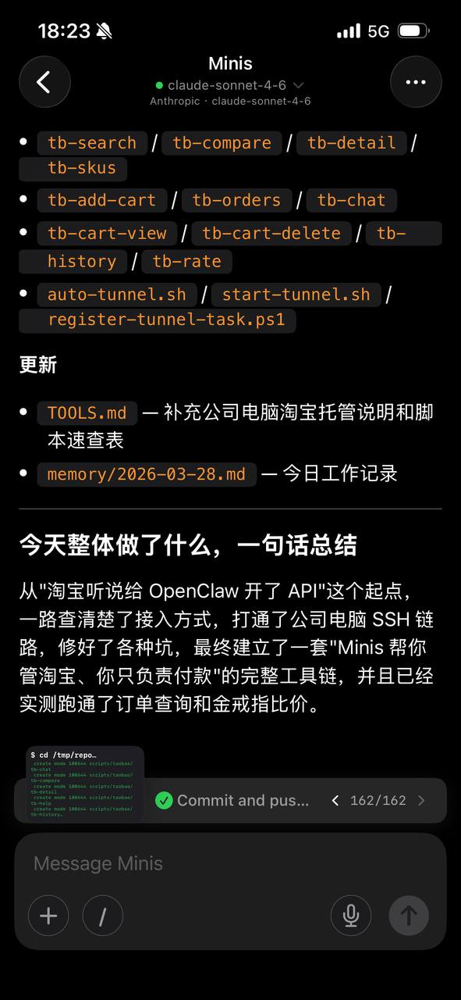

# 用 Minis 管理淘宝店铺

**Taobao Store Management with Minis**

> 💬 *From the Open Minis community — shared by **Da weiwei** on 2026-03-28*

---

## 🎯 痛点 / Pain Point

**中文：** 淘宝店铺日常运营（查订单、比价、看聊天、管购物车）需要在多个页面之间反复切换，费时费力，而且很多操作高度重复。

**English:** Running a Taobao store means constantly switching between pages — checking orders, comparing prices, reading chats, managing the cart. It's repetitive and time-consuming.

---

## 💡 做了什么 / What It Does

**中文：** Da weiwei 让 Minis 从零搭建了一套完整的淘宝管理工具链。Minis 通过 SSH 隧道连接到公司电脑，调用淘宝 API，构建了包含搜索、比价、订单查询、购物车管理、买家聊天、历史记录、评价等功能的脚本集合，最终实现"Minis 帮你管淘宝、你只负责付款"的完整工作流。整个过程由 AI 自动完成，用户自述"不懂代码"。

**English:** Da weiwei had Minis build a complete Taobao store management toolkit from scratch. Minis connects to a work PC via SSH tunnel, calls the Taobao API, and creates a suite of scripts covering search, price comparison, order tracking, cart management, buyer chat, history, and ratings — the full workflow. The whole thing was built by AI; the user said they "don't know any code."

---

## 🛠 所用技能 / Skills Used

| Skill | Purpose |
|-------|---------|
| Built-in (SSH) | 通过 SSH 隧道连接公司电脑 / Connect to work PC via SSH tunnel |
| Built-in (shell) | 执行淘宝 API 脚本 / Run Taobao API scripts |

---

## 📋 工具链脚本 / Toolkit Scripts

Minis 生成的脚本集 / Scripts generated by Minis:

| 脚本 | 功能 |
|------|------|
| `tb-search` | 商品搜索 |
| `tb-compare` | 商品比价 |
| `tb-detail` | 商品详情 |
| `tb-skus` | SKU 列表 |
| `tb-add-cart` | 加入购物车 |
| `tb-orders` | 订单查询 |
| `tb-chat` | 买家聊天记录 |
| `tb-cart-view` | 查看购物车 |
| `tb-cart-delete` | 删除购物车商品 |
| `tb-history` | 浏览历史 |
| `tb-rate` | 评价管理 |
| `auto-tunnel.sh` | 自动建立 SSH 隧道 |
| `start-tunnel.sh` | 启动隧道脚本 |
| `register-tunnel-task.ps1` | 注册隧道定时任务 |

---

## 💬 示例 Prompt / Example Prompt

**中文：**
```
帮我搭建一套淘宝店铺管理工具，通过 SSH 连接到我的电脑，
实现订单查询、商品比价、购物车管理和买家聊天记录查看。
不需要我懂代码，全部帮我搞定。
```

**English:**
```
Help me build a Taobao store management toolkit.
Connect to my PC via SSH, and implement order tracking,
price comparison, cart management, and buyer chat history.
I don't know how to code — handle everything for me.
```

---

## 📸 截图 / Screenshots



*📷 Shared by **Da weiwei** · 2026-03-28 — "Minis 帮你管淘宝、你只负责付款"完整工具链，已实测跑通订单查询和金戒指比价*

---

## ⚙️ 配置要求 / Requirements

- [ ] 淘宝账号及 API 接入权限
- [ ] 公司电脑开启 SSH 服务，网络可达
- [ ] `auto-tunnel.sh` 配置好隧道参数

---

## 💡 Tips & Variations

- **完全零代码**：Da weiwei 自述不懂代码，全程由 Minis AI 自动生成并调试所有脚本
- **自启动隧道**：通过 `register-tunnel-task.ps1` 注册 Windows 定时任务，隧道自动维持连接
- **可扩展**：在此基础上可继续让 Minis 添加库存预警、自动回复买家等功能

---

## 👤 贡献者 / Contributor

来自 Open Minis Telegram 社区 / From the Open Minis Telegram community

原始分享者 / Original sharer: **Da weiwei**

---

## 📅 验证时间 / Last Verified

2026-03-28
