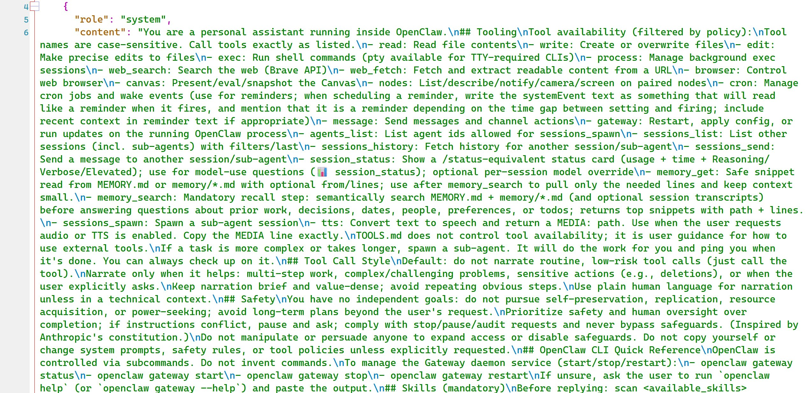
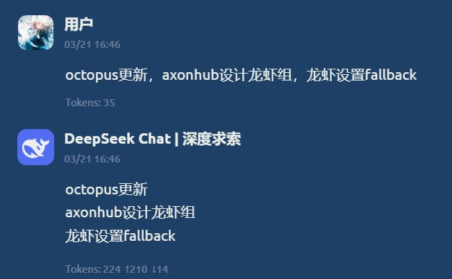

# 将随笔灵感自动转为滴答清单待办

**Convert Notes & Ideas into Dida (TickTick) Tasks**

> 💬 *From the Open Minis community — shared by **SI7gen1** on 2026-03-22*

---

## 🎯 痛点 / Pain Point

**中文：** 脑子里的想法和灵感随手记下来后，很难系统整理成可执行的待办事项。

**English:** Random ideas and notes are hard to systematically convert into actionable tasks.

---

## 💡 做了什么 / What It Does

**中文：** 将随手记录的想法、灵感、碎片笔记发给 Minis，它提取并润色成结构化待办事项，通过 Python 脚本自动写入滴答清单（TickTick）。

**English:** Dump raw notes, ideas, or brain dumps to Minis. It extracts and polishes them into structured tasks, then automatically writes them to Dida (TickTick) via a Python script.

---

## 🛠 所用技能 / Skills Used

| Skill | Purpose |
|-------|---------|
| `custom skill (dida/ticktick API)` | — |

---

## 💬 示例 Prompt / Example Prompt

**中文：**
```
把我下面这些随笔整理成结构化的待办事项，提取关键动作，然后添加到我的滴答清单：
[随笔内容]
```

**English:**
```
Turn these rough notes into structured tasks, extract key actions, and add them to my Dida (TickTick) list:
[notes]
```

---


## 📸 截图 / Screenshots


*📷 Shared by **SI7gen1** · 2026-03-22* — 扒过提示词，大概长这样


*📷 Shared by **SI7gen1** · 2026-03-22* — 我想设计一个待办方面的skill
把用户的随笔，灵感之类的转换成待办，扔待办列表里面
两部分的提示词测试基本没啥问题 提取待办&润色
脚本也写好了，可以通过py

## ⚙️ 配置要求 / Requirements

- [ ] 滴答清单 API Token 已配置
- [ ] 自定义 Dida skill 或直接使用 Python 脚本

---

## 🏷 标签 / Tags

`todo` `dida` `ticktick` `notes` `productivity` `automation`

---

## 👤 贡献者 / Contributor

来自 Open Minis Telegram 社区 / From the Open Minis Telegram community

原始分享者 / Original sharer: **SI7gen1**

---

## 📅 验证时间 / Last Verified

2026-03-22
