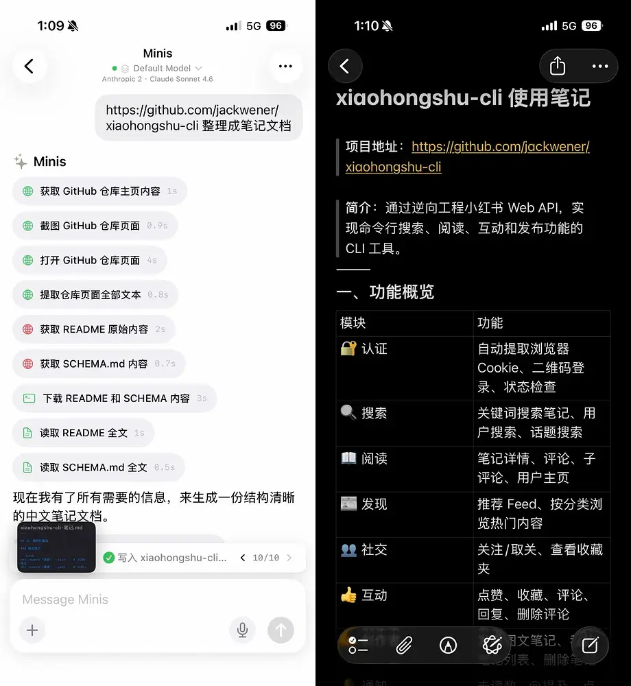

# 网页内容自动整理成 Apple Notes 笔记

**Web Page → Auto-Organized Apple Notes**

> 💬 *From [@wsvn53](https://x.com/wsvn53) · 2026-03-11 / appinn.com · 2026-03-28*

---

## 🎯 痛点 / Pain Point

**中文：** 看到有价值的 GitHub 项目或技术文档，想保存成笔记，但直接收藏链接以后根本不会再看，手动整理又太耗时。

**English:** When you find a valuable GitHub project or technical doc, bookmarking the link means you'll never read it again — but manually organizing it into notes takes too long.

---

## 💡 做了什么 / What It Does

**中文：** 把网页链接发给 Minis，它自动抓取内容、提炼要点、整理成结构化 Markdown 笔记，并打开 Markdown 预览。在预览页点击分享按钮，即可导出到 Apple Notes（或任意其他 App）。

**English:** Send a URL to Minis, it fetches the content, extracts key points, and formats them as structured Markdown notes — then opens a Markdown preview. From the preview, tap the share button to export directly to Apple Notes (or any other app).

---

## 🛠 所用技能 / Skills Used

| Skill | Purpose |
|-------|---------|
| Built-in (browser_use) | 抓取网页内容 / Fetch web page content |
| Built-in (Markdown preview) | 生成预览文件，通过系统分享导出到 Apple Notes / Generate preview file, export to Apple Notes via system share sheet |

---

## 💬 示例 Prompt / Example Prompt

**中文：**
```
帮我把这个 GitHub 项目整理成学习笔记，生成 Markdown 预览：
https://github.com/jackwener/xiaohongshu-cli
```

**English:**
```
Summarize this GitHub project into study notes and open a Markdown preview:
https://github.com/jackwener/xiaohongshu-cli
```

---


## 📸 截图 / Screenshots



*📷 发送 GitHub 链接 → Minis 整理成结构化笔记 → 写入 Apple Notes · @wsvn53 via appinn.com · 2026-03-11*

## ⚙️ 配置要求 / Requirements

- [ ] 无需额外配置，Markdown 预览为 Minis 内置能力
- [ ] 导出时通过系统分享菜单选择 Apple Notes（或其他目标 App）

---

## 💡 Tips

- 支持任意网页：技术文档、新闻文章、产品介绍页
- 可以指定笔记格式，如「用 Markdown 标题分节」或「只提炼 5 个要点」
- 在预览页点击右上角分享图标，可导出到 Apple Notes、Bear、Obsidian 等任意支持导入的 App

---

## 👤 贡献者 / Contributor

[@wsvn53](https://x.com/wsvn53) · [appinn.com](https://www.appinn.com/iphone-automation-11-real-use-cases/)

## 📅 Last Verified

2026-03-11
