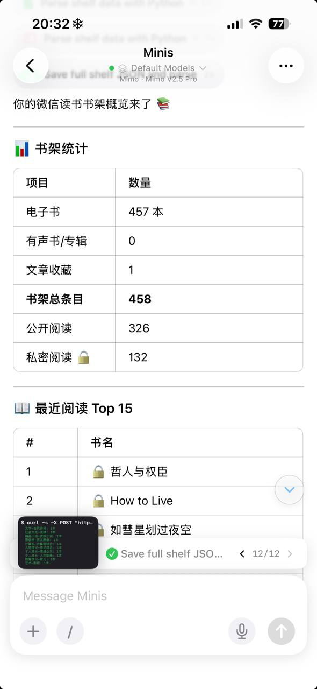
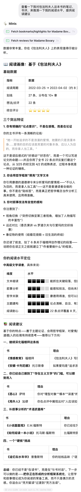

# 微信读书 Skill——让 AI 成为你的阅读搭档

**WeRead Skill — Let AI Become Your Reading Companion**

> 💬 *From **𝐍𝐢𝐜𝐤𝐢𝐥𝐢𝐬𝐦** · 2026-05-16 (via Open Minis Telegram)*

---

## 🎯 痛点 / Pain Point

**中文：** 微信读书书架里积累了几百本书，想知道自己真正读了哪些、读了多久、划了哪些线、哪些书值得继续读，但手动整理太费事。

**English:** You've accumulated hundreds of books on WeRead, but it's hard to know what you've actually read, how long you spent, which highlights you made, and what to read next — all without manual effort.

---

## 💡 做了什么 / What It Does

**中文：** 微信读书官方开放了 Minis Skill（`weread-skills`），连接微信读书账号后，AI 可以随时查阅你的阅读记录。问一句话，Minis 就能：

- 📚 **查阅书架**：浏览个人书架，统计电子书数量、公开/私密阅读情况
- 🔍 **书籍搜索**：在书城搜索任意书籍，获取书名、作者、评分等关键信息
- 📊 **阅读统计**：分析阅读时长、天数、偏好，量化阅读习惯
- 📖 **书籍详情**：查看章节目录、阅读进度、了解阅读旅程
- ✏️ **笔记和划线**：查看个人划线和想法，导出笔记，回顾阅读中的思考
- ⭐ **推荐好书**：基于阅读偏好，个性化推荐相似书籍

实测：Minis 根据《包法利夫人》的 27 条划线和笔记，分析出三个阅读特征，定位阅读水平为「中高级文学读者」，并给出四个方向的书单推荐。

**English:** WeRead officially released a Minis Skill (`weread-skills`). Connect your WeRead account and AI can access your reading data on demand. One sentence, and Minis can:

- 📚 **Browse bookshelf**: view your personal library, count books by category and privacy setting
- 🔍 **Search books**: find any book in the WeRead store with title, author, rating and more
- 📊 **Reading stats**: analyze reading time, days, and preferences to quantify your reading habits
- 📖 **Book details**: view chapter list, reading progress, and your reading journey
- ✏️ **Notes & highlights**: review personal highlights and thoughts, export notes
- ⭐ **Book recommendations**: get personalized suggestions based on your reading taste

Real test: based on 27 highlights and notes from *Madame Bovary*, Minis identified 3 reading characteristics, assessed reading level as "intermediate-advanced literary reader", and recommended 4 curated reading paths.

---

## 🛠 所用技能 / Skills Used

| Skill | Purpose |
|-------|---------|
| `微信读书` | 连接微信读书账号，查询书架/笔记/统计/推荐 / Connect WeRead account to query shelf, notes, stats, recommendations |

---

## 💬 示例 Prompt / Example Prompt

**中文：**
```
给我看一下我的书架概览
```
```
查一下我对《包法利夫人》这本书的笔记、书评、来源，测评一下我的阅读水平，提供阅读建议
```

**English:**
```
Show me an overview of my bookshelf
```
```
Check my notes and highlights on Madame Bovary, assess my reading level, and give me reading recommendations
```

---

## 📸 截图 / Screenshots






---

## ⚙️ 配置要求 / Requirements

- [ ] 安装微信读书官方 Skill：[weread.qq.com/r/weread-skills](https://weread.qq.com/r/weread-skills)
- [ ] 按页面引导连接微信读书账号（快速配置）

---

## 💡 Tips

**中文：**
- 可以直接问「帮我找最近没读完的书」「我最常读哪类书」等自然语言问题
- 结合 Minis 的分析能力，可以深度挖掘阅读习惯，生成个人阅读报告

**English:**
- Ask natural questions like "find books I haven't finished recently" or "what genres do I read most"
- Combine with Minis' analysis capabilities to generate in-depth personal reading reports

---

## 👤 贡献者 / Contributor

来自 Open Minis Telegram 社区 / From the Open Minis Telegram community

原始分享者 / Original sharer: **𝐍𝐢𝐜𝐤𝐢𝐥𝐢𝐬𝐦**

---

## 📅 Last Verified

2026-05-16
