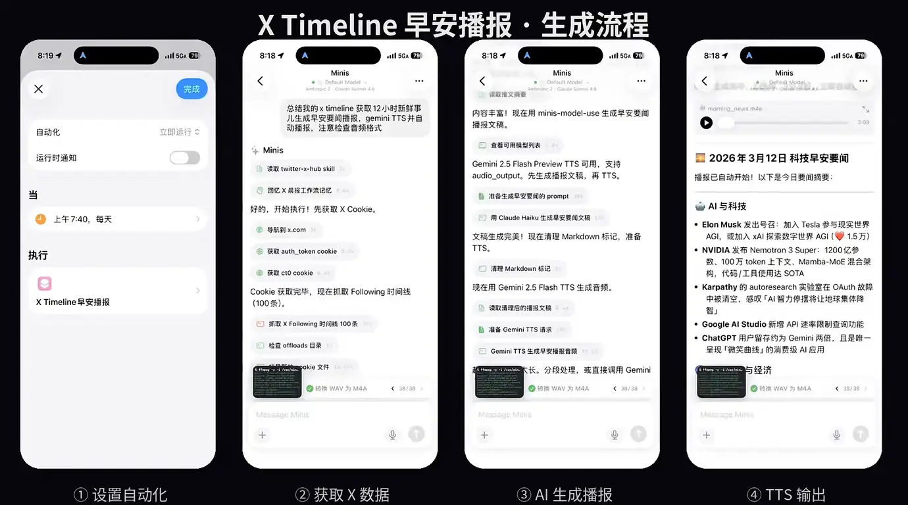

# X Timeline 语音早报（自动叫醒）

**X Timeline Voice Briefing — Replaces Your Morning Alarm**

> 💬 *From [@wsvn53](https://x.com/wsvn53) · 2026-03-12*

---

## 🎯 痛点 / Pain Point

**中文：** 每天早上要花时间刷 X/Twitter 才能了解昨晚发生了什么，而且闹钟叫醒后还是昏昏沉沉。

**English:** Every morning you scroll X/Twitter to catch up on what happened overnight — and a regular alarm still leaves you groggy.

---

## 💡 做了什么 / What It Does

**中文：** 通过 iOS 快捷指令设置定时自动化，每天早上触发 Minis：用 `twitter-x-hub` 抓取过去 12 小时的 X Timeline，AI 汇总成早报文稿，调用 TTS 生成语音，自动播放——用播报声代替闹钟叫醒。

**English:** An iOS Shortcuts automation triggers Minis every morning: `twitter-x-hub` fetches the past 12 hours of X Timeline, AI summarizes it into a briefing script, TTS generates audio, and it auto-plays — waking you up with a spoken news briefing instead of an alarm.

---

## 🛠 所用技能 / Skills Used

| Skill | Purpose |
|-------|---------|
| `twitter-x-hub` | 抓取 X Timeline / Fetch X Timeline |
| `doubao-tts` | 生成语音播报 / Generate voice audio |
| iOS Shortcuts | 定时自动触发 / Scheduled automation |

---

## 💬 示例 Prompt / Example Prompt

**中文：**
```
抓取我过去 12 小时的 X Timeline，总结成一份早报，
用豆包 TTS 生成语音文件并播放。
```

**English:**
```
Fetch my X Timeline from the past 12 hours, summarize it
into a morning briefing, generate audio with doubao-tts and play it.
```

---


## 📸 截图 / Screenshots



*📷 X Timeline 早安播报完整流程：① 设置自动化 ② 获取X数据 ③ AI生成播报 ④ TTS输出 · @wsvn53 via appinn.com · 2026-03-12*

## ⚙️ 配置要求 / Requirements

- [ ] `twitter-x-hub` skill 已安装，X 账号 Cookie 已配置
- [ ] `doubao-tts` skill 已安装，API 凭证已配置
- [ ] iOS 快捷指令设置早晨定时自动化

---

## 👤 贡献者 / Contributor

[@wsvn53](https://x.com/wsvn53)

## 📅 Last Verified

2026-03-12
