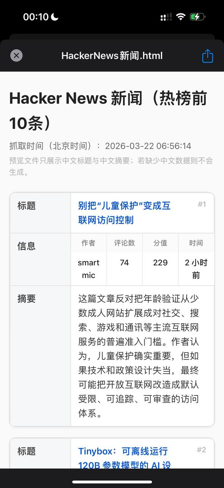

# 抓取 HK 新闻并生成中文 HTML 摘要

**Fetch HK News & Generate Chinese HTML Digest**

> 💬 *From the Open Minis community — shared by **meng nimen** on 2026-03-22*

---

## 🎯 痛点 / Pain Point

**中文：** 香港/英文新闻需要手动翻译阅读，且没有统一的中文摘要入口。

**English:** Hong Kong/English news requires manual translation, with no unified Chinese summary.

---

## 💡 做了什么 / What It Does

**中文：** 让 Minis 抓取香港新闻网站文章，自动翻译并总结成中文，最后整理成格式化 HTML 文件发送给自己，实现跨语言新闻摘要。

**English:** Minis fetches articles from Hong Kong news sites, translates and summarizes them into Chinese, then formats the results as a clean HTML file — a cross-language news digest pipeline.

---

## 🛠 所用技能 / Skills Used

| Skill | Purpose |
|-------|---------|
| `built-in (browser_use)` | — |

---

## 💬 示例 Prompt / Example Prompt

**中文：**
```
抓取 hknews 今天的头条新闻，访问每篇原文，用中文总结要点，整理成格式化 HTML 文件发给我。
```

**English:**
```
Fetch today's top stories from hknews, visit each article, summarize in Chinese, and format as a clean HTML digest.
```

---


## 📸 截图 / Screenshots



*📷 Shared by **meng nimen** · 2026-03-22* — HackerNews 热榜中文摘要 HTML

## ⚙️ 配置要求 / Requirements

- [ ] 无需额外配置

---

## 🏷 标签 / Tags

`news` `translation` `html` `browser` `digest`

---

## 👤 贡献者 / Contributor

来自 Open Minis Telegram 社区 / From the Open Minis Telegram community

原始分享者 / Original sharer: **meng nimen**

---

## 📅 验证时间 / Last Verified

2026-03-22
