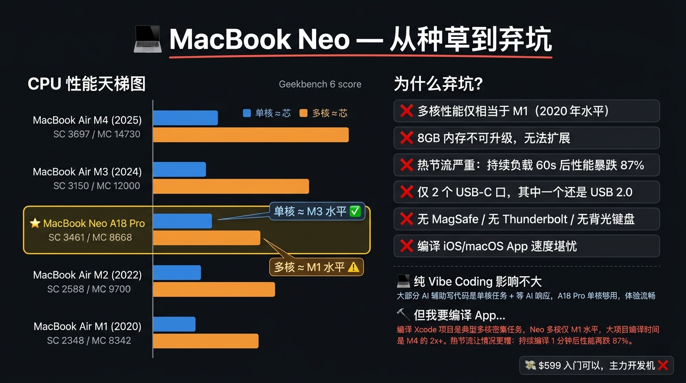

# 买前必看：用 Minis 做购物决策分析（以 MacBook Neo 为例）

**One Prompt → Full Purchase Decision Report with Benchmark Ladder, Pros/Cons & Price Research**

---

## 🎯 痛点 / Pain Point

**中文：** 买一台新电脑前，需要：刷大量测评视频、手动查各平台价格、对比历代机型跑分、搞清楚国补叠加规则——信息分散在 B 站、科技媒体、Geekbench、京东促销页之间，往往看完更乱。

**English:** Before buying a new laptop, you need to: watch tons of review videos, manually check prices across platforms, compare benchmark scores across generations, and figure out subsidy stacking rules — information scattered across YouTube, tech blogs, Geekbench, and retailer promo pages, often leaving you more confused than before.

---

## 💡 做了什么 / What It Does

**中文：** 对 Minis 说一句话，它自动联网抓取 Geekbench 6 跑分数据、各大科技媒体评测、国内电商价格与国补政策，生成：

- **CPU 性能天梯图**：单核 / 多核双维度，精准标注目标机型对标哪几款
- **弃坑清单**：结构化列出核心缺点，并注明对不同使用场景的影响程度
- **使用场景分析**：区分「纯 Vibe Coding」vs「编译 App」等不同需求的适配度
- **国内到手价速查**：官方定价 → 国补后 → 叠加教育优惠 → 以旧换新最低价，一张表看清楚
- **一张信息图**：AI 直接生成可分享的购物决策图，标题党风格，种草 / 弃坑一目了然

以 MacBook Neo（A18 Pro，¥4599 起）为例，5 分钟内得出结论：
- 单核性能 ≈ MacBook Air M3，多核仅 ≈ M1（2020 年水平）
- 国补后 ¥3909，叠加教育优惠低至 ¥3399
- 纯 Vibe Coding 够用，但编译 iOS App 是多核密集任务，Neo 热节流后性能暴跌 87%，大项目编译时间是 M4 的 2x+
- **结论：¥599 入门可以，主力开发机 ❌**

**English:** Say one sentence to Minis, and it automatically fetches Geekbench 6 scores, tech media reviews, domestic pricing and subsidy policies, generating:

- **CPU Benchmark Ladder**: single-core / multi-core dual dimensions, precisely annotating which models the target competes with
- **Deal-Breaker List**: structured cons with impact level per use case
- **Use Case Analysis**: differentiates "pure Vibe Coding" vs "compiling apps" and other needs
- **China Price Breakdown**: MSRP → after subsidy → with education discount → max trade-in savings, all in one table
- **Shareable Infographic**: AI-generated purchase decision visual, "hype vs. drop" style

Example: MacBook Neo (A18 Pro, ¥4,599) — conclusion in 5 minutes:
- Single-core ≈ MacBook Air M3, multi-core only ≈ M1 (2020)
- ¥3,909 after national subsidy, ¥3,399 with education discount
- Fine for pure Vibe Coding, but compiling iOS apps is multi-core intensive — Neo throttles 87% after 60s of sustained load, 2x+ compile time vs M4
- **Verdict: Great at $599, not a dev machine ❌**

---

## 🛠 所用技能 / Skills Used

| Skill | Purpose |
|-------|---------|
| Built-in (`browser_use`) | 联网抓取 Geekbench 跑分、科技媒体评测、电商价格 / Fetch benchmarks, reviews, prices |
| Built-in (shell + Python) | 数据整理与对比分析 / Data aggregation and comparison |
| `nano-banana-2` (Gemini Image) | 生成购物决策信息图 / Generate shareable infographic |

---

## 💬 示例 Prompt / Example Prompt

**中文：**
```
看看 MacBook Neo CPU 和各项性能跑分指标与 MacBook 其他哪几款相当？
```

```
Neo 国内国补下来多少钱？
```

```
生成一张图，标题是「MacBook Neo 从种草到弃坑」，
左边是 Neo 天梯图单核和多核对标其他款，
右边列举缺点，并说明不过好像对纯 Vibe Coding 影响不大，
但我需要编译 app。
```

**English:**
```
How does the MacBook Neo's CPU and benchmark scores compare to other MacBook models?
```

```
What's the price of MacBook Neo in China after the national subsidy?
```

```
Generate an infographic titled "MacBook Neo — From Hype to Drop",
left side shows a benchmark ladder comparing single-core and multi-core vs other Macs,
right side lists the cons, noting it's fine for pure Vibe Coding
but I need to compile apps.
```

---

## ⚙️ 配置要求 / Requirements

- [ ] `nano-banana-2` 模型（Gemini 图像生成）：需在 Minis 设置中配置 Gemini API Key 或中转站 Key
- [ ] 其余功能（联网搜索、数据分析）：无需额外配置，Minis 内置能力即可

---

## 💡 Tips

- 可替换任意数码产品，如「iPhone 17e 对比历代 iPhone SE」「RTX 5080 对比 4090 性价比」
- 生成的信息图可直接截图分享到微博 / 小红书 / 朋友圈
- 国补政策每季度可能更新，建议询问时加上当前年月以获取最新数据
- 对于开发者，重点问「多核性能」和「热节流」，这两项决定编译体验

---

## 📸 Screenshots



---

## 👤 贡献者 / Contributor

Internal case · Added 2026-04-09

## 📅 Last Verified

2026-04-09
