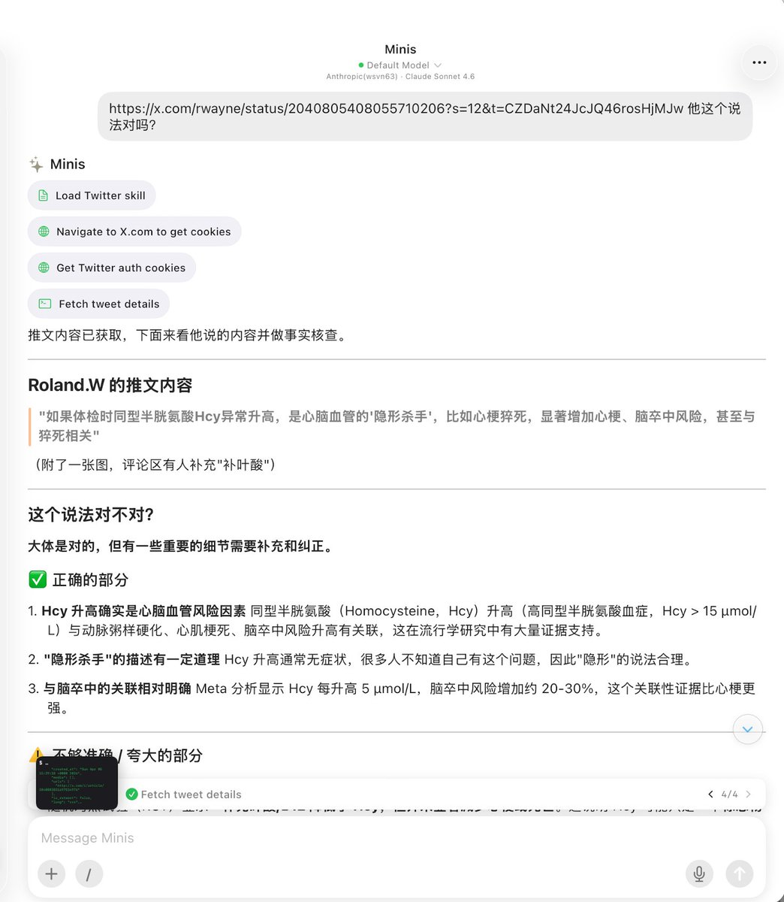
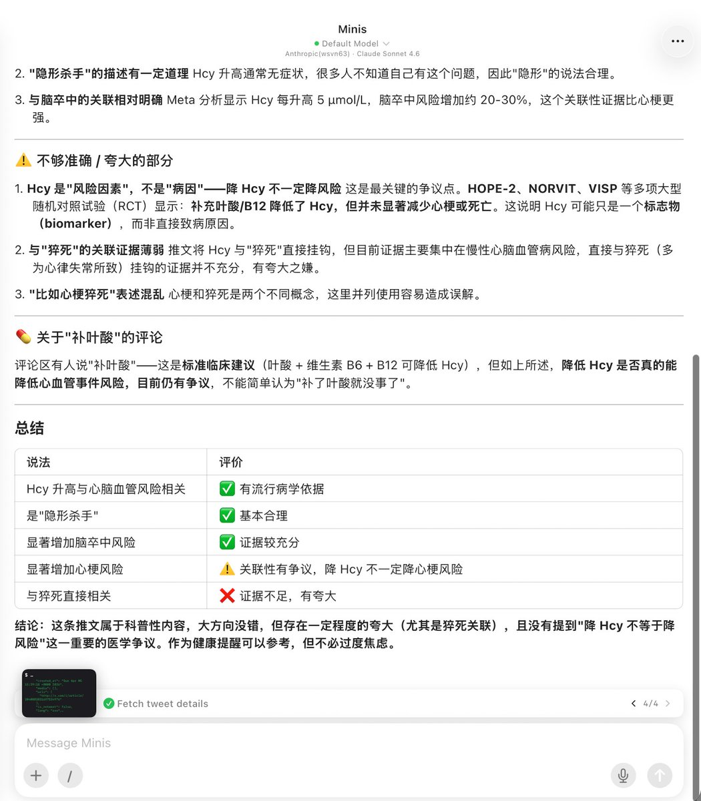

# Tweet Fact-Check: Verify Health Claims with Minis

> **By [@wsvn53](https://x.com/wsvn53) · Apr 6, 2026** · [Original Tweet](https://x.com/wsvn53/status/2041181979308347818)

## 🇨🇳 中文

### 痛点

社交媒体上充斥着各种健康科普推文，有些夸大其词甚至有误导性，但普通人没有医学背景很难判断真假，只能全信或全不信。

### 做了什么

看到一条关于"同型半胱氨酸 Hcy 异常升高是心脑血管隐形杀手、与猝死相关"的推文，觉得说法可疑，直接把推文链接发给 Minis，让它做事实核查。

Minis 自动完成（4 步）：
1. 加载 twitter-x-hub skill
2. 导航到 X.com 获取 Cookie 认证
3. 抓取推文原文内容
4. 基于医学文献进行事实核查

**核查结果（结构化评价表）：**

| 说法 | 评价 |
|------|------|
| Hcy 升高与心脑血管风险相关 | ✅ 有流行病学依据 |
| 是"隐形杀手" | ✅ 基本合理 |
| 显著增加脑卒中风险 | ✅ 证据较充分（每升高 5 μmol/L，风险增加 20-30%）|
| 显著增加心梗风险 | ⚠️ 关联性有争议，降 Hcy 不一定降心梗风险 |
| 与猝死直接相关 | ❌ 证据不足，有夸大 |

**关键纠正：**
- HOPE-2、NORVIT、VISP 等多项 RCT 显示：补充叶酸/B12 降了 Hcy，但**并未显著减少心梗或死亡**——Hcy 可能只是标志物，非直接病因
- "与猝死直接相关"证据薄弱，有夸大之嫌

**结论：** 大方向不错，但存在一定程度夸大（尤其是猝死关联），作为健康提醒可参考，但不必过度焦虑。

### 示例 Prompt

```
https://x.com/rwayne/status/xxx 他这个说法对吗？
```

---

## 🇺🇸 English

### Pain Point

Social media is full of health claims — some exaggerated or misleading. Without a medical background, it's hard to tell fact from fiction.

### What It Does

After seeing a tweet claiming "elevated homocysteine (Hcy) is a hidden cardiovascular killer linked to sudden death," @wsvn53 sent the link to Minis for a fact-check.

Minis automatically (4 steps):
1. Loads twitter-x-hub skill
2. Navigates to X.com to get auth cookies
3. Fetches the original tweet content
4. Performs a medical literature fact-check

**Fact-check result (structured evaluation table):**

| Claim | Verdict |
|-------|---------|
| Elevated Hcy correlates with cardiovascular risk | ✅ Epidemiological evidence supports this |
| It's a "hidden killer" | ✅ Largely reasonable |
| Significantly increases stroke risk | ✅ Good evidence (each +5 μmol/L ≈ +20-30% stroke risk) |
| Significantly increases heart attack risk | ⚠️ Controversial — lowering Hcy doesn't necessarily reduce MI risk |
| Directly linked to sudden death | ❌ Insufficient evidence, exaggerated |

**Key correction:**
- HOPE-2, NORVIT, VISP RCTs show: folate/B12 lowered Hcy but did **not** significantly reduce MI or death — Hcy may be a biomarker, not a direct cause
- The "sudden death" link is overstated

**Conclusion:** The general direction is right, but the claim is somewhat exaggerated (especially the sudden death link). Fine as a health reminder, but no need to panic.

### Example Prompt

```
https://x.com/someone/status/xxx — Is this claim accurate?
```

### Requirements

- `twitter-x-hub` skill installed, X.com cookies available (auto-fetched via browser)

---

## 📸 Screenshots





📷 Shared by [@wsvn53](https://x.com/wsvn53) · 2026-04-06

---

**Last Verified:** 2026-04-06
**Category:** Research
**Contributor:** [@wsvn53](https://x.com/wsvn53)
